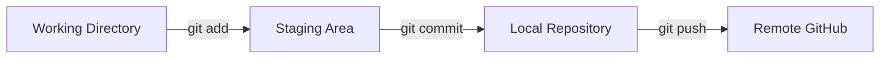

# TIL 만들기-Git기본명령어와 마크다운
> 작성일: 2026-07-22

# TIL — Git 기본 흐름 · CLI 명령어 · 마크다운

## 제미나이가 잘 못해서 클로드가 초안 도와줌

날짜: 2026-07-22
오늘 한 줄 요약: Git의 4단계 흐름(Working → Staging → Local → Remote)을 이해하고, -u 옵션의 의미와 CLI/마크다운 기초를 정리했다.

---

## 1. Git 기본 흐름



핵심은 add와 commit이 분리되어 있다는 것이다. 수정한 파일 10개 중 3개만 이번 커밋에 포함하고 싶을 때, git add file1 file2 file3으로 원하는 파일만 골라 담을 수 있다. 이게 Staging Area가 존재하는 이유다.

---

## 2. 명령어 정리

### 최초 설정 (딱 1번)

```bash
git init                                # 현재 폴더를 Git 저장소로 초기화
git config --global user.name "이름"     # 커밋에 기록될 이름
git config --global user.email "이메일"  # 커밋에 기록될 이메일
git remote add origin <원격 URL>         # GitHub 저장소와 연결
git branch -M main                      # 기본 브랜치명을 main으로
git push -u origin main                 # 첫 푸시 + 추적 관계 설정
```

### 매일 반복하는 흐름

```bash
git status              # 뭐가 바뀌었는지 확인 (습관화할 것)
git add .                # 변경사항 전체 스테이징
git commit -m "설명"     # 스냅샷 저장
git push                 # 원격에 반영
```

### 조회용

```bash
git log --oneline        # 커밋 이력 한 줄씩 보기 (log보다 이걸 더 자주 쓰게 됨)
git branch --show-current # 지금 어느 브랜치에 있는지
git remote -v             # 원격 저장소 주소 확인
git clone <URL>           # 원격 저장소 복제
```

---

## 3. Q&A — u 옵션이 왜 필요한가

git push origin master
그때그때 "이 브랜치를 저 브랜치로 보내라"고 매번 목적지를 지정하는 방식.

git push -u origin master-u(--set-upstream)는 로컬 브랜치와 원격 브랜치를 기억시켜 연결하는 옵션이다. 한 번 설정해두면 이후엔 git push, git pull만 쳐도 Git이 "아, master는 origin/master랑 연결돼 있지" 하고 알아서 목적지를 찾아간다.

> 비유하자면 매번 전화번호를 눌러 거는 것(push origin master)과, 한 번 저장해두고 이름만 눌러 거는 것(push -u 이후의 push)의 차이다. 실무에서는 브랜치 처음 만들 때 한 번만 -u를 쓰고, 그다음부턴 그냥 git push만 치는 게 일반적이다.

---

## 4. CLI 필수 명령어

---

## 5. 마크다운 기본 문법

제목: #~###### (h1~h6)

강조

* 이탤릭* 또는 _이탤릭_
* *볼드** 또는 __볼드__
* ~~취소선~~
코드

* 인라인: `print("Hello")`
* 블록:
```plain text
```python
for i in range(5):
    print(i)
```
```

링크/이미지

* 링크: [표시 텍스트](URL)
* 이미지: 
---

## 6. Q&A — 업스트림(u)은 매번 해줘야 하나?

한 번만 하면 끝이다. VS Code를 껐다 켜든 컴퓨터를 재부팅하든 상관없이, git push -u origin main을 한 번 실행하면 그 연결(추적 관계)은 해당 로컬 저장소 폴더에 영구적으로 저장된다.

정확히는 .git/config 파일에 기록된다:

```bash
cat .git/config
```

```plain text
[branch "main"]
    remote = origin
    merge = refs/heads/main
```

이게 한 번 저장되면, 이후로는 그 폴더에서 git push만 쳐도 알아서 origin main으로 간다.

다시 -u가 필요한 경우는 이럴 때뿐:

* 새 브랜치를 처음 만들었을 때 (아직 연결이 안 됐으므로)
* 저장소를 새로 클론하거나 새로 만들었을 때
* 다른 컴퓨터에서 같은 저장소를 새로 받았을 때
즉, main 브랜치 하나로 계속 작업한다면 오늘 이후로는:

```bash
git add .
git commit -m "메시지"
git push
```

이 세 줄이면 충분하다.

---

## 7. Q&A — 다른 프로젝트에 잘못 푸시될 위험은 없나?

origin 연결은 "폴더" 단위로 저장된다. 각 프로젝트 폴더 안의 .git/config에 그 폴더만의 원격 주소가 따로 저장되는 것이지, 컴퓨터 전체에 적용되는 전역 설정이 아니다.

```plain text
Desktop/github2/TIL       → .git/config에 TIL 저장소 주소 저장
Desktop/다른프로젝트        → .git/config에 다른 저장소 주소 저장
```

터미널에서 git push를 치면, 그 명령은 **"지금 터미널이 위치한 폴더"**의 .git 설정을 보고 어디로 보낼지 판단한다.

```bash
cd Desktop/github2/TIL
git push    # → TIL 저장소로 감

cd ../다른프로젝트
git push    # → 다른프로젝트 저장소로 감
```

위험한 경우는 딱 하나 — 터미널 경로를 착각한 채로 명령을 치는 것. TIL 폴더에 있다고 착각했는데 실제로는 다른 프로젝트 폴더였다면, 엉뚱한 파일이 엉뚱한 저장소로 갈 수 있다.

습관 들이면 좋은 것 — git add 치기 전에 먼저:

```bash
pwd             # 지금 어느 폴더에 있는지 확인
git remote -v   # 이 폴더가 어느 원격 저장소랑 연결됐는지 확인
```

이 두 개를 먼저 확인하는 습관을 들이면 "잘못된 프로젝트에 푸시"하는 실수는 거의 막을 수 있다. VS Code에서는 왼쪽 하단에 현재 열려있는 폴더 이름이 표시되니 그것도 같이 확인하면 좋다.

---

## 회고 (KPT)

Keep

* Git 4단계 흐름을 그림으로 그려보니 add/commit이 왜 분리돼 있는지 감이 잡혔다.
Problem

* u 옵션처럼 "왜 필요한지"가 처음엔 안 와닿는 개념들이 있었다. 단순 암기로는 오래 못 감.
Try

* 다음 실습부터는 git push -u origin main을 최초 1회만 쓰고 이후 git push만 쓰는 걸 직접 확인해보기.
* 매일 최소 1개 커밋 남기기 — 작은 문서 수정이라도.
