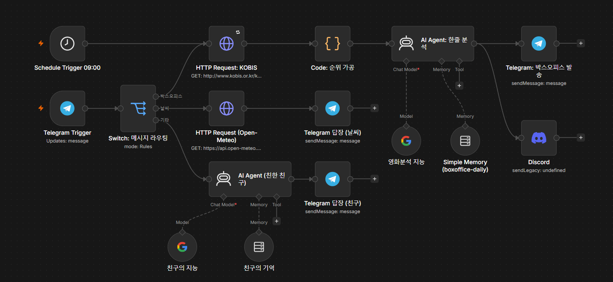
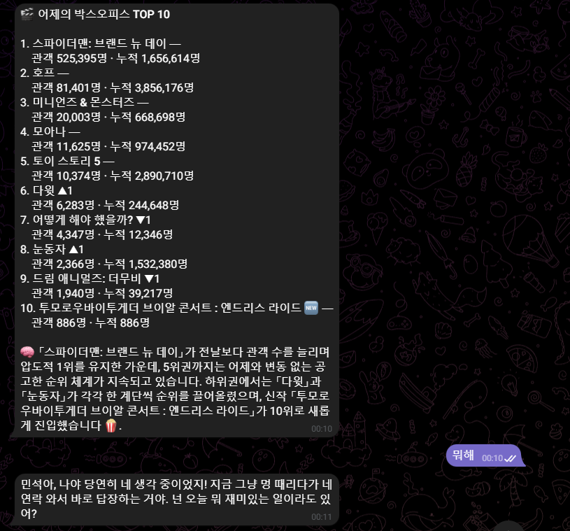

 
# 🎬 n8n 박스오피스 알림 구축 (KOBIS API → 텔레그램 + 디스코드)

> 작성일: 2026-07-31 (작업 시각 23:00 ~ 08-01 00:10)
> 성격: **수업 필기가 아니라 개인 실습과제 구축 기록이다.** 수업에서 배운 Telegram Trigger / HTTP Request / AI Agent / Simple Memory 를 실제 서비스 하나로 조립하면서 겪은 문제와 해결 과정을 남긴다.

## 🔗 관련 글

- [2026-07-31 웹기초와 텔레그램n8n 실습](2026-07-31_웹기초와_텔레그램n8n_실습.md) — 이 노트는 그날 16:00~18:00 실습과제의 결과물이다
- [2026-07-30 서버 클라이언트 설명](2026-07-30_서버_클라이언트_설명.md) — Schedule Trigger, HTTP Request, 디스코드 웹훅의 기본 사용법
- [2026-07-29 재미나이 API 활용 기본실습](2026-07-29_재미나이api_활용_기본실습.md) — API 키를 코드에 직접 쓰지 않는 이유

---

## 1. 목표와 전체 구조

`public-apis-4Kr` 라는 한국 공개 API 모음집에서 API 하나를 골라, n8n으로 **텔레그램과 디스코드 양쪽에 알림을 보내는 자동화**를 만드는 것이 과제였다.

고른 API는 **영화진흥위원회(KOBIS) 일별 박스오피스**다. GET 요청 한 번으로 끝나고 응답 JSON이 깔끔해서, API 자체와 씨름하는 대신 "호출 → 가공 → 다중 채널 발송" 흐름에 집중할 수 있다.

완성된 동작은 세 가지다.

1. 매일 오전 9시에 전일 박스오피스 TOP 10 + AI 한줄 분석이 텔레그램·디스코드 양쪽에 자동 발송된다.
2. 텔레그램 봇에게 "영화" 또는 "박스오피스" 라고 말하면 즉시 같은 내용으로 답장이 온다. (양방향)
3. 기존에 만들어둔 "날씨" 분기와 "일반 대화(친구 AI)" 분기는 그대로 유지된다.

### 노드 구성

```
[Schedule Trigger 09:00] ───────────────────────┐
                                                 │
[Telegram Trigger] → [Switch] ─"박스오피스"──────┤
                        │                        ▼
                        │            [HTTP Request: KOBIS]
                        │                        ▼
                        │            [Code: 순위 가공]
                        │                        ▼
                        │            [AI Agent: 한줄 분석] ← [Simple Memory]
                        │                        ├──→ [Telegram: 박스오피스 발송]
                        │                        └──→ [Discord]
                        │
                        ├─"날씨"──→ [HTTP Request (Open-Meteo)] → [Telegram 답장 (날씨)]
                        └─"기타"──→ [AI Agent (친한 친구)] ─────→ [Telegram 답장 (친구)]
```

핵심 설계는 **트리거 2개가 같은 노드 입력으로 합류한다**는 점이다. `Schedule Trigger` 와 `Switch` 의 `박스오피스` 출력이 둘 다 `HTTP Request: KOBIS` 로 들어간다. n8n에서는 서로 다른 트리거의 선을 같은 노드에 연결할 수 있고, 실제로 실행된 쪽의 데이터만 흘러간다. 그래서 정기 발송과 온디맨드 조회가 **같은 처리 로직을 공유**할 수 있다.


### ⚠️ 왜 워크플로우를 새로 만들지 않고 기존 것에 합쳤나

**텔레그램은 봇 하나당 웹훅(webhook)이 하나만 등록된다.** 웹훅은 "사용자가 봇에게 말을 걸면 이 주소로 알려줘"라고 텔레그램 서버에 등록해두는 콜백 주소다.

같은 봇 토큰으로 워크플로우 A와 B에 각각 Telegram Trigger를 두고 둘 다 Active로 켜면, **나중에 켠 쪽이 웹훅을 가져가고 먼저 켠 쪽은 아무 에러 없이 조용히 죽는다.** 에러가 안 나기 때문에 원인을 찾기가 매우 어렵다.

그래서 오늘 수업에서 만든 챗봇 워크플로우의 `If` 노드를 `Switch` 로 바꾸고 분기를 하나 늘리는 방식을 선택했다.

---

## 2. KOBIS API 키 발급

### 키 발급 화면에서 입력한 값

| 항목 | 입력값 | 의미 |
|---|---|---|
| 사용 목적 | AI 에이전트를 사용한 SNS 박스오피스 랭킹 분석 알림 서비스 구현 | 심사용 설명 |
| 관리명 | n8n 박스오피스 알림봇 | 나중에 키 목록에서 구분하기 위한 내 이름표 |
| 사용 URL | `https://noviz35.app.n8n.cloud` | 이 키로 API를 호출할 서비스 주소 |

**관리명은 심사 대상이 아니라 내가 붙이는 이름표다.** 키를 여러 개 발급받았을 때 "이 키가 어디 쓰이는 건지" 구분하는 용도다.

**사용 URL은 n8n Cloud 인스턴스 주소**를 넣었다. 브라우저 주소창의 `https://noviz35.app.n8n.cloud/home/workflows` 에서 **경로(`/home/workflows`)를 떼고 도메인까지만** 쓴다.

> ➕ **더 알아두기**
> KOBIS는 사용 URL을 기준으로 호출을 차단하지 않는다(Referer 검증이 없다). 즉 나중에 로컬 n8n으로 옮기거나 다른 주소에서 호출해도 키는 그대로 동작한다. 하지만 API 제공자마다 정책이 달라서, 어떤 API는 등록한 도메인 외에서 호출하면 거부한다.

### 요청 명세

- URL: `http://www.kobis.or.kr/kobisopenapi/webservice/rest/boxoffice/searchDailyBoxOfficeList.json`
- Method: `GET`
- 필수 파라미터: `key` (발급받은 키), `targetDt` (조회 날짜, `YYYYMMDD` 8자리)
- 선택 파라미터: `itemPerPage` (가져올 개수, 10으로 지정)

### 응답 구조

```
boxOfficeResult
├── boxofficeType    "일별 박스오피스"
├── showRange        "20260730~20260730"
└── dailyBoxOfficeList[]
    ├── rank            순위 ("1")
    ├── rankInten       전일 대비 순위 증감 ("0", "1", "-2")
    ├── rankOldAndNew   "NEW" 또는 "OLD"
    ├── movieNm         영화명
    ├── openDt          개봉일 ("2026-07-29")
    ├── audiCnt         해당일 관객수
    ├── audiAcc         누적 관객수
    ├── scrnCnt         상영관수
    └── showCnt         상영횟수
```

**모든 숫자가 문자열(`"441554"`)로 온다.** 그래서 계산이나 자릿수 콤마를 붙일 때는 `Number()` 로 변환해야 한다.

---

## 3. 인증 키를 어디에 넣는가 — Credential vs Query Parameter

처음에 이걸 헷갈려서 **노드의 Query Parameters 칸에 `Name=key`, `Value=키값` 을 직접 적었다.** 이건 잘못된 위치다.

### 올바른 방법: Query Auth Credential

HTTP Request 노드에서 `Authentication` → `Generic Credential Type` → `Query Auth` 를 고르고, `Set up credential` 로 별도 창을 열어 입력한다.

| Credential 창의 칸 | 입력값 |
|---|---|
| Name | `key` |
| Value | 발급받은 KOBIS 키 |
| Allowed HTTP Request Domains | `Specific Domains` → `*.kobis.or.kr` |

이 창의 Name/Value는 **"모든 요청의 쿼리스트링에 `?key=발급키` 를 자동으로 붙여줘"** 라는 뜻이다. Name이 파라미터의 *이름*, Value가 그 *값*이다.

### 왜 이렇게 하는가

| | Query Parameters에 직접 | Query Auth Credential |
|---|---|---|
| 키 노출 | 노드 화면에 평문으로 보인다 | 마스킹(`●●●●`)된다 |
| 워크플로우 내보내기(JSON) | **키가 그대로 포함된다** | 포함되지 않는다 |
| 재사용 | 노드마다 다시 입력 | 여러 노드가 같은 것을 선택 |

### Allowed HTTP Request Domains

이 설정은 **"이 인증정보를 어느 도메인으로 보내는 요청에까지 붙일 수 있는가"** 를 정한다.

기본값 `All` 로 두면, 실수로(또는 다른 워크플로우에서) 엉뚱한 서버를 호출할 때 **KOBIS 키가 그 서버로 함께 전송된다.** `*.kobis.or.kr` 로 제한하면 그 도메인 외에는 키가 절대 나가지 않는다.

### ⚠️ 헷갈리기 쉬운 점

- Credential의 Name은 **API 문서에 적힌 파라미터 이름과 정확히 일치**해야 한다. KOBIS는 `key` 이므로 대문자 `Key` 로 쓰면 인증에 실패한다.
- Credential을 만들었다고 끝이 아니다. **노드의 `Query Auth` 드롭다운에서 그것을 실제로 선택**해야 적용된다. `No credentials yet` 으로 남아 있으면 아무 효과가 없다.

---

## 4. Expression(`fx`) 모드 — 날짜를 자동 계산하기

`targetDt` 는 매일 바뀌어야 하므로 고정값을 쓸 수 없다. n8n 표현식으로 계산한다.

```
{{ $now.setZone('Asia/Seoul').minus({ days: 1 }).toFormat('yyyyMMdd') }}
```

- `$now` — 현재 시각
- `.setZone('Asia/Seoul')` — 한국 시간대 기준으로 해석
- `.minus({ days: 1 })` — 하루 전
- `.toFormat('yyyyMMdd')` — `20260730` 형태 8자리 문자열로 변환

### 왜 어제 날짜인가

**KOBIS 일별 박스오피스는 전일 매출이 익일 새벽~오전에 집계 확정된다.** 오늘 날짜로 조회하면 `dailyBoxOfficeList` 가 빈 배열로 온다. 그래서 "어제의 박스오피스"를 보내는 것이 정상이다.

실제로 자정을 넘긴 00:05 시점에 핀을 풀고 호출했다면 `targetDt` 가 `20260731` 로 계산되어 빈 결과가 왔을 것이다. 오전 9시 스케줄 실행 시각에는 이미 집계가 끝나 있으므로 문제가 없다.

### `fx` 모드를 켜지 않으면

이게 오늘 실제로 겪은 첫 번째 에러다.

```json
{
  "faultInfo": {
    "message": "날짜는 필수항목입니다.[parameterName=targetDt,parameterValue=null]",
    "errorCode": "320102"
  }
}
```

입력 칸이 **Fixed 모드**면 `{{ $now... }}` 가 **계산되지 않고 글자 그대로** 전송된다. 서버는 그걸 날짜로 해석할 수 없으니 `null` 로 처리한다.

### ⚠️ 확인 방법

`fx` 모드로 전환하면 **입력 칸 바로 아래에 계산 결과가 회색 미리보기로 표시된다.** 거기에 `20260730` 처럼 8자리 숫자가 보이면 성공이고, `{{ $now...` 글자가 그대로 보이면 아직 Fixed 모드다.

> ♻️ 처음엔 "Credential 창에 Name/Value를 넣는 것"과 "노드의 Query Parameters에 Name/Value를 넣는 것"이 같은 일이라고 생각했으나, 전자는 **인증**이고 후자는 **조회 조건**이다. 최종 요청은 두 개가 합쳐진 `?key=발급키&targetDt=20260730&itemPerPage=10` 형태가 된다.

---

## 5. https 연결 실패와 http 전환

`targetDt` 를 고친 뒤에도 요청이 계속 실패했다. 이번엔 에러의 성격이 달랐다.

```
The connection timed out, consider setting the 'Retry on Fail' option
The connection was aborted, perhaps the server is offline
```

이건 **설정 오류가 아니라 네트워크 계층의 실패**다. 서버에 요청이 닿지 못하거나, 닿았지만 응답을 받기 전에 연결이 끊긴 상태다.

### 진단

내 PC에서 같은 주소를 직접 호출해봤더니 정상이었다.

```
STATUS: 200
{"faultInfo":{"message":"유효하지않은 키값입니다.","errorCode":"320010"}}
```

키를 `test` 로 보냈으니 키 오류가 난 건 당연하다. 중요한 건 **서버가 살아있고 https 요청도 받는다**는 사실이다. 즉 KOBIS 서버 자체는 문제가 없었다.

### 해결

URL의 프로토콜을 `https` → `http` 로 바꾸니 바로 성공했다.

```
http://www.kobis.or.kr/kobisopenapi/webservice/rest/boxoffice/searchDailyBoxOfficeList.json
```

KOBIS 공식 문서도 `http` 로 안내하고 있다. n8n Cloud 서버에서 KOBIS로 나가는 **TLS 핸드셰이크(암호화 연결을 맺는 첫 절차)** 단계가 불안정했던 것으로 보인다.

> ➕ **더 알아두기**
> `http` 로 바꾸면 쿼리스트링이 암호화되지 않으므로 **API 키가 평문으로 네트워크를 지나간다.** 오늘 배운 HTTPS의 의미가 그대로 적용되는 자리다. 공개 통계 데이터라 실질적 위험은 낮지만, 결제·개인정보를 다루는 API라면 절대 이렇게 해결하면 안 된다. 그럴 때는 프록시를 쓰거나 API 제공자에게 문의해야 한다.

### Timeout과 재시도 설정

공공 API는 간헐적으로 느려지거나 죽는다. 실제로 오늘 실행 기록을 보면 1~2분씩 걸려 실패한 건이 여러 개 있었다.

`HTTP Request` 노드의 `Settings` 탭에서 설정한다.

| 항목 | 값 | 의미 |
|---|---|---|
| Timeout | `30000` | 30초 안에 응답이 없으면 포기 |
| Retry On Fail | ON | 실패 시 자동 재시도 |
| Max Tries | `3` | 최대 3번까지 |
| Wait Between Tries | `5000` | 재시도 간 5초 대기 |

이건 테스트 편의가 아니라 **매일 아침 9시 실행의 성공률을 지키는 설정**이다. 재시도가 없으면 그 시각 KOBIS가 한 번 느린 것만으로 그날 알림이 통째로 사라진다.

### ⚠️ 헷갈리기 쉬운 점

**테스트 중에는 이 값을 낮게 잡아야 한다.** 처음에 Timeout 60초 × Max Tries 5회로 설정했더니, 뭔가 잘못됐을 때 확인하는 데만 5분 이상 걸렸다. 그 대기 시간이 "노드가 무한 로딩된다"처럼 보여서 원인을 엉뚱한 곳에서 찾게 됐다.

- 개발·테스트: Timeout `15000`, Max Tries `2`
- 실전(Publish 전): Timeout `30000`, Max Tries `3`

---

## 6. 핀(Pin) 데이터 — 응답 고정

KOBIS가 불안정한 상태에서 아래쪽 노드를 다듬으려면 매번 API를 다시 부르게 되는데, 그때마다 실패할 위험이 있다. 이럴 때 쓰는 기능이 **핀**이다.

노드를 열고 **OUTPUT 패널 오른쪽 위의 📌 아이콘**을 클릭하면 그때 받은 응답이 그 노드에 저장된다. 패널 상단에 `This data is pinned for test executions` 라고 표시되고, 캔버스에서는 노드에 📌 표시가 붙고 나가는 **연결선이 보라색**으로 바뀐다.

### 핀의 정확한 의미

여기서 큰 착각을 했다.

> ♻️ 처음엔 "핀을 걸면 그 노드가 실행 대상이 되어 다음 노드가 알아서 입력을 받는다"고 이해했으나, **핀은 "그 노드가 실행될 때 실제 API 호출 대신 저장된 응답을 쓴다"는 뜻**이다. 즉 **응답을 대체하는 것이지, 실행 경로를 만들어주는 것이 아니다.**

### 왜 Code 노드가 작동하지 않았나

KOBIS에 핀을 걸어둔 상태에서 `Code` 노드를 실행했는데 계속 결과가 나오지 않았다. 원인은 **실행 시작점**이었다.

트리거가 2개라서 n8n이 시작점을 하나 골라야 하는데, 화면 아래 버튼이 `Execute workflow from Telegram Trigger` 로 되어 있었다. 그 경로로 실행하면:

```
Telegram Trigger → Switch (핀된 메시지 텍스트를 검사)
                    └─ "박스오피스/영화/순위" 없음 → 기타 출력으로 빠짐
                       → KOBIS·Code 는 경로에서 벗어나 실행 자체가 안 됨
```

Code 노드로 오는 길이 막혀 있었던 것이다.

**해결**: `Schedule Trigger 09:00` 노드에 마우스를 올려 나타나는 **▶ 버튼**으로 실행했다. 또는 `Execute workflow` 버튼 오른쪽 `⌄` 를 눌러 시작 트리거를 직접 고를 수 있다. 그러자 Code 노드가 즉시 작동했다.

### ⚠️ 반드시 기억할 것

**Publish(Active) 켜기 전에 핀을 반드시 해제해야 한다.** 핀이 걸린 채로 두면 매일 아침 **7월 30일 데이터가 영원히 발송**된다. OUTPUT 패널 상단의 `Unpin` 을 누르면 된다.

---

## 7. If → Switch 교체 (분기 3개)

기존 챗봇은 `If` 노드로 "날씨냐 아니냐" 두 갈래만 나눴다. 박스오피스가 추가되면서 세 갈래가 필요해져 `Switch` 노드(Rules 모드)로 바꿨다.

| Output | 이름 | 조건 (`{{ $json.message.text }}`) | 연결 대상 |
|---|---|---|---|
| 0 | `박스오피스` | contains `박스오피스` OR `영화` OR `순위` | HTTP Request: KOBIS |
| 1 | `날씨` | contains `날씨` OR `추워` OR `더워` | HTTP Request (Open-Meteo) |
| — | `기타` (fallback) | 위 어디에도 안 걸리는 모든 메시지 | AI Agent (친한 친구) |

fallback은 `Options` → **`Fallback Output = extra`** 로 설정하면 별도 출력이 하나 더 생긴다.

### If와 Switch의 차이

- `If` — 조건이 참/거짓 **두 갈래**. 조건이 하나일 때 적합하다.
- `Switch` — 규칙을 여러 개 만들어 **여러 갈래**로 보낸다. 각 출력에 이름을 붙일 수 있어(`renameOutput`) 캔버스에서 읽기 쉽다.

**교체할 때 기존 노드 내부 설정은 하나도 건드리지 않았다.** `Weather` / `AI Agent (친한 친구)` 같은 노드는 그대로 두고, **들어오는 연결선만** If에서 Switch의 해당 출력으로 갈아 끼웠다.

### ⚠️ 헷갈리기 쉬운 점

작업 전에 워크플로우를 **Download(JSON 내보내기)로 백업**해두는 것이 안전하다. 연결선을 옮기다 기존 분기가 끊기면 되돌릴 수 있다.

---

## 8. Code 노드 — 데이터 가공

API 응답을 그대로 보낼 수는 없으니 사람이 읽을 형태로 바꾼다. Mode는 `Run Once for All Items` 다.

```javascript
const list = $input.first().json.boxOfficeResult.dailyBoxOfficeList;

const arrow = (n) => {
  const v = Number(n);
  if (v > 0) return `▲${v}`;
  if (v < 0) return `▼${Math.abs(v)}`;
  return '─';
};
const num = (n) => Number(n).toLocaleString('ko-KR');

const rows = list.map((m) => ({
  rank: m.rank,
  name: m.movieNm,
  inten: arrow(m.rankInten),
  badge: m.rankOldAndNew === 'NEW' ? ' 🆕' : '',
  audi: num(m.audiCnt),
  acc: num(m.audiAcc),
}));

const telegramText =
  `🎬 <b>어제의 박스오피스 TOP 10</b>\n\n` +
  rows
    .map((r) => `${r.rank}. <b>${r.name}</b>${r.badge} ${r.inten}\n    관객 ${r.audi}명 · 누적 ${r.acc}명`)
    .join('\n');

const discordText =
  `🎬 **어제의 박스오피스 TOP 10**\n\n` +
  rows
    .map((r) => `\`${r.rank}\` **${r.name}**${r.badge} ${r.inten} — 관객 ${r.audi}명 (누적 ${r.acc}명)`)
    .join('\n');

const forAi = rows
  .map((r) => `${r.rank}위 ${r.name}${r.badge} (증감 ${r.inten}, 관객 ${r.audi}, 누적 ${r.acc})`)
  .join('\n');

return [{ json: { telegramText, discordText, forAi } }];
```

### 왜 문자열을 3개 만드는가

**채널마다 굵게 표시하는 문법이 다르기 때문이다.**

| 채널 | 굵게 | 비고 |
|---|---|---|
| 텔레그램 (Parse Mode = HTML) | `<b>텍스트</b>` | HTML 태그 |
| 디스코드 | `**텍스트**` | 마크다운 |

`forAi` 는 AI에게 넘길 압축 요약이다. 텍스트에 HTML 태그나 마크다운 기호가 섞이면 AI가 그걸 내용으로 오해할 수 있어서, 태그 없는 별도 버전을 만들었다.

### 다뤄야 했던 데이터 변환

- **문자열 → 숫자**: `rankInten` 이 `"0"`, `"-2"` 처럼 문자열로 오므로 `Number()` 로 바꿔야 크기 비교가 된다. 문자열끼리 `>` 비교하면 엉뚱한 결과가 나온다.
- **자릿수 콤마**: `Number(441554).toLocaleString('ko-KR')` → `441,554`
- **순위 증감을 기호로**: `+1` → `▲1`, `-2` → `▼2`, `0` → `─`
- **신작 표시**: `rankOldAndNew === 'NEW'` 일 때만 🆕 를 붙인다.

### ⚠️ 헷갈리기 쉬운 점

**`Execute step` 을 누르면 위쪽 노드들이 다시 실행된다.** Code 노드는 KOBIS 응답이 있어야 돌아가기 때문이다. 그래서 아래쪽 노드를 반복 테스트할 때는 위쪽 API 노드에 핀을 걸어두는 것이 필수다.

> ➕ **더 알아두기**
> n8n Cloud는 Code 노드를 **별도 프로세스(task runner)** 에서 실행한다. 그래서 Code 노드만 유독 느리거나 멈추는 현상이 생길 수 있다. 반대로 **표현식(`{{ }}`)은 메인 프로세스에서 계산**된다. Code 노드가 계속 문제를 일으키면, 같은 가공을 `Edit Fields (Set)` 노드의 표현식으로 옮기는 우회법이 있다.

---

## 9. AI Agent + Simple Memory - 한줄 분석

가공한 순위 데이터를 AI에게 넘겨 관전 포인트를 쓰게 했다.

- Source for Prompt: `Define below`
- Prompt (User Message, `fx`): `{{ $json.forAi }}`
- Chat Model: Google Gemini Chat Model
- Memory: Simple Memory

### System Message

```
# Role
너는 박스오피스 데이터를 짧게 해석해 주는 영화 칼럼니스트야.

# Instructions
1. 아래 순위 데이터를 보고 2~3문장으로 오늘의 관전 포인트를 써줘.
2. 이전 대화에 어제 순위가 남아 있으면 반드시 비교해서 언급해 (1위 교체, 신작 진입, 급락 등).
3. 데이터에 없는 줄거리·평점·배우 정보는 절대 추측해서 쓰지 마.
4. 존댓말, 이모지는 최대 1개.
5. 영화 제목에 꺾쇠괄호(< >)를 절대 쓰지 마. 「」 를 써.
```

3번은 **환각(hallucination) 방지**다. AI는 영화 제목을 보면 아는 척 줄거리나 평점을 지어낼 수 있는데, 알림에 거짓 정보가 섞이면 안 된다.

5번을 넣은 이유는 아래 10번 항목에서 설명한다.

### Simple Memory 설정

| 항목 | 값 |
|---|---|
| Session Key | `boxoffice-daily` (고정 문자열) |
| Context Window Length | `20` |

**Session Key는 사물함 이름표다.** 처음 실행할 때 그 이름으로 저장소가 만들어지고, 다음 실행 때 그 이름표를 보고 어제 기록을 찾아온다.

`{{ $now }}` 나 `{{ $execution.id }}` 처럼 **매번 값이 바뀌는 표현식을 넣으면 안 된다.** 매일 새 사물함이 열려서 메모리가 완전히 무의미해진다.

`Context Window Length = 20` 은 "대화 왕복 20번을 기억한다"는 뜻이다. 하루 1번 실행이면 약 20일치다. 그래서 AI가 "전날과 비교해…" 같은 문장을 쓸 수 있다. 별도의 계산 기능이 있는 게 아니라 **지난 대화 텍스트를 다시 읽는 것**이다.

### ⚠️ 헷갈리기 쉬운 점

**메모리 1일차에는 비교 문장이 나오지 않는 게 정상이다.** 비교할 어제 기록이 아직 없기 때문이다. 실제로 첫 실행 결과는 "전날과 비교해 순위와 관객 수치가 변동 없이 유지되었습니다"였는데, 이건 메모리가 아니라 **`rankInten` 이 전부 `0`** 이라는 데이터를 읽고 쓴 문장이다.

**온디맨드 조회도 같은 메모리에 쌓인다.** 텔레그램으로 "영화"를 여러 번 물어보면 하루에 여러 건이 기록되어 "어제 대비" 비교가 흐려질 수 있다. 분리하려면 온디맨드용 AI Agent를 따로 두고 메모리를 떼면 된다.

---

## 10. Telegram HTML 파싱 에러 — 오늘 가장 배울 게 많았던 부분

발송 직전 단계에서 이 에러가 났다.

```
Bad Request: can't parse entities: Unsupported start tag "스파이더맨:" at byte offset 825
```

### 원인

AI가 영화 제목을 이렇게 썼다.

```
전날과 비교해 1위 <스파이더맨: 브랜드 뉴 데이>를 비롯한 모든 작품의 …
```

우리는 텔레그램에 `Parse Mode = HTML` 로 보내고 있다. 그러면 텔레그램은 `<` 를 만나면 **HTML 태그의 시작으로 해석**한다. `<스파이더맨:` 은 알려진 태그가 아니므로 파싱에 실패하고, 메시지 전체가 발송되지 않는다.

즉 **우리 코드가 만든 `<b>` 태그와, AI가 쓴 꺾쇠괄호를 텔레그램이 구분하지 못하는 것**이다.

### 해결 — 두 겹으로 막았다

**① 안전장치 (근본적)** — Telegram 노드 Text 표현식에서 치환한다.

```
{{ $('Code: 순위 가공').first().json.telegramText }}

🧠 {{ $json.output.replace(/</g, '「').replace(/>/g, '」') }}
```

AI 응답(`$json.output`)에 들어온 `<` `>` 만 「」 로 바꾼다. 우리가 만든 `telegramText` 는 정상 태그이므로 손대지 않는다.

**② 예방 (프롬프트)** — System Message에 5번 규칙을 추가했다.

②만으로는 부족하다. AI는 확률적으로 답하므로 언젠가 또 꺾쇠를 쓸 수 있다. **AI 출력을 그대로 신뢰하지 않고 코드로 한 번 걸러내는 것**이 핵심이다.

결과적으로 텔레그램에는 `「스파이더맨: 브랜드 뉴 데이」` 로, 디스코드에는 원문 그대로 도착했다. **디스코드는 HTML을 파싱하지 않으므로 꺾쇠가 와도 안전하다.**

> ➕ **더 알아두기**
> 이 문제는 웹 개발에서 **HTML 이스케이프(escape)** 라고 부르는 주제와 같다. 사용자 입력에 `<script>` 같은 태그가 들어왔을 때 그대로 출력하면 브라우저가 코드로 실행해버리는 **XSS 공격**이 되므로, `<` 를 `&lt;` 로 바꿔 출력한다. 오늘 한 치환은 그 축소판이다.

---

## 11. 트리거 2개에 대응하는 Chat ID

텔레그램 발송에는 "누구에게 보낼지"를 나타내는 `Chat ID` 가 필요하다. 그런데 경로가 두 개다.

- **Telegram Trigger 경로** — 말을 건 사람에게 답장해야 한다 → `message.chat.id` 에 값이 있다
- **Schedule Trigger 경로** — Telegram Trigger가 실행되지 않았으므로 그 값이 **없다**

그래서 `isExecuted` 로 갈랐다.

```
{{ $('Telegram Trigger').isExecuted ? $('Telegram Trigger').first().json.message.chat.id : '6251200031' }}
```

`$('노드이름').isExecuted` 는 그 노드가 이번 실행에서 실제로 실행됐는지 알려주는 값이다. 실행됐으면 거기서 chat id를 꺼내고, 아니면 미리 알아둔 내 chat id를 쓴다.

### ⚠️ 여기서 위험한 함정을 하나 발견했다

테스트할 때 미리보기에 chat id가 잘 표시돼서 통과한 줄 알았다. 그런데 그건 **Telegram Trigger에 핀 데이터가 남아 있어서 `isExecuted` 가 `true` 로 판정된 것**이었다.

실제 아침 9시 자동 실행에서는 Telegram Trigger가 실행되지 않으므로 `false` → 뒤쪽 값이 쓰인다. 만약 거기에 `'내_chat_id'` 같은 자리표시자를 그대로 뒀다면 **테스트는 통과하는데 실전에서는 100% 실패**하는 상태였다.

**교훈: 조건 분기의 `false` 쪽 경로도 반드시 실제 값으로 채워야 한다.** 테스트가 통과하는 것과 실전에서 동작하는 것은 별개다.

### 내 chat id 확인 방법

`Telegram Trigger` 노드를 열어 출력의 `message.chat.id` 를 보면 된다. `from.id` 와 같은 값이다(1:1 대화이므로).

---

## 12. Discord 노드 설정

`Discord` 노드에서 두 가지 문제를 겪었다.

### ① `Node does not require credentials`

노드가 `sendLegacy` 라는 낡은 동작 모드로 잡혀 있었다. 그 모드는 인증정보를 쓰지 않는데 웹훅 Credential이 붙어 있어서 충돌한 것이다. **노드를 삭제하고 새로 만들어** 해결했다.

| 항목 | 값 |
|---|---|
| Connection Type | `Webhook` |
| Credential for Discord Webhook | 등록해둔 웹훅 |
| Resource | `Message` |
| Operation | `Send a Message` |
| Message (`fx`) | `{{ $('Code: 순위 가공').first().json.discordText }}` + AI 출력 |

### ② `Node 'Code: 순위 가공' hasn't been executed`

새로 만든 노드에 **들어오는 연결선을 잇지 않았다.** n8n에서 `$('노드이름')` 으로 다른 노드를 참조하려면, **그 노드가 실행 경로상 위쪽에 있어야 한다.** 연결이 없으면 경로 자체가 없으므로 참조가 무효가 된다.

`AI Agent: 한줄 분석` 출력에서 선을 끌어 Discord 입력에 연결하고, **Ctrl+S로 저장**한 뒤 해결됐다.

### ⚠️ 실행 기록은 스냅샷이다

`Executions` 탭에서 과거 실행을 열면 **그 당시의 워크플로우 구조**가 그려진다. 노드를 새로 만들거나 연결을 고친 뒤에는 그 기록에 반영되지 않는다. 그래서 "에디터에는 연결돼 있는데 실행 기록에는 없다"는 상황이 생긴다. 구조를 고쳤으면 **새로 실행해서 새 기록을 확인**해야 한다.

### 디스코드 웹훅은 URL 자체가 열쇠다

Discord 노드가 계속 말썽이면 오늘 배운 HTTP Request로 직접 보낼 수도 있다.

| 항목 | 값 |
|---|---|
| Method | `POST` |
| URL | 디스코드 채널 웹훅 URL |
| Send Body | ON / Body Content Type `JSON` |
| Body Parameter | Name `content`, Value 보낼 내용 |

**디스코드 웹훅은 인증 헤더가 없다. URL 자체가 비밀값**이라서, 그 주소로 `{"content": "..."}` 를 POST 하면 그냥 전송된다. 그래서 웹훅 URL이 유출되면 누구나 그 채널에 글을 쓸 수 있다.

---

## 13. 병렬 발송과 에러 처리

`AI Agent: 한줄 분석` 의 출력에서 연결선을 **두 개** 뽑아 텔레그램과 디스코드에 각각 연결했다. 이러면 두 채널로 동시에 발송된다.

```
AI Agent: 한줄 분석 ─┬─→ Telegram: 박스오피스 발송
                     └─→ Discord
```

### ⚠️ 한쪽 실패가 다른 쪽을 막는다

텔레그램이 HTML 파싱 에러로 실패했을 때, **디스코드까지 발송이 진행되지 않았다.** n8n은 노드 하나가 에러를 내면 실행을 멈춘다.

한쪽이 죽어도 다른 쪽은 보내고 싶다면, 노드의 `Settings` → **`On Error`** 를 `Continue` 로 바꾸면 된다.

---

## 14. 완성 후 마무리 체크리스트




테스트가 끝나고 실전으로 전환할 때 확인해야 할 것들이다. **수동 실행으로는 검증되지 않는 항목이 섞여 있어서** 놓치기 쉽다.

| # | 항목 | 위치 | 안 하면 |
|---|---|---|---|
| 1 | **KOBIS 핀 해제** | 노드 OUTPUT 패널 → `Unpin` | 매일 7/30 데이터가 영원히 발송된다 |
| 2 | **Timezone = `Asia/Seoul`** | 워크플로우 `···` → `Settings` | UTC 기준이라 오후 6시에 발송된다 |
| 3 | Timeout `30000` / Max Tries `3` | KOBIS 노드 `Settings` 탭 | KOBIS가 느린 날 알림이 사라진다 |
| 4 | **Publish (Active) ON** | 오른쪽 위 `Publish` 버튼 | 스케줄이 아예 작동하지 않는다 |
| 5 | Chat ID 자리표시자 교체 | Telegram 노드 | 자동 실행 시 발송 실패한다 |

### Timezone 설정 위치

**왼쪽 사이드바의 `Settings` 가 아니다.** 그건 인스턴스(계정) 전체 설정이고, 거기엔 타임존이 없다.

에디터 화면 **오른쪽 위 `Publish` 버튼 옆의 `···` (점 3개)** → `Settings` 로 들어가야 워크플로우 개별 설정이 나온다. 여기에 Timezone, Execution Order, 실행 기록 저장 여부 등이 있다.

기본값은 `Default - ...` 인데 이건 인스턴스 기본 타임존을 따른다는 뜻이라 한국 시간이 아닐 수 있다. **명시적으로 `Asia/Seoul (GMT+09:00)` 을 고르는 것이 안전하다.**

같은 창의 `Save failed production executions` 는 기본값이 `Save` 라서 그대로 두면 된다. 실패한 실행이 Executions 탭에 남아 원인을 볼 수 있다.

---

## 15. 오늘 만난 에러 모아보기

| 에러 메시지 | 원인 | 해결 |
|---|---|---|
| `날짜는 필수항목입니다.[parameterName=targetDt,parameterValue=null]` | `targetDt` 파라미터 자체가 없거나 Fixed 모드로 표현식이 계산되지 않음 | 파라미터 추가 + `fx` 모드 전환 |
| `유효하지않은 키값입니다.` (320010) | 키가 틀렸거나 전달되지 않음 | Credential Name이 `key` 인지, 노드에서 선택됐는지 확인 |
| `The connection timed out` / `was aborted` | 네트워크 계층 실패 (TLS 불안정) | URL을 `https` → `http` 로 변경 |
| `Cannot read properties of undefined (reading 'dailyBoxOfficeList')` | `boxOfficeResult` 가 없음 = API가 정상 응답을 안 줬음 | Code 노드가 아니라 **위쪽 HTTP 응답**을 먼저 확인 |
| `Bad Request: can't parse entities: Unsupported start tag` | Parse Mode HTML에서 `<` 를 태그로 해석 | `.replace()` 로 꺾쇠 치환 |
| `Node does not require credentials` | 노드가 낡은 동작 모드로 잡힘 | 노드 삭제 후 재생성 |
| `Node 'Code: 순위 가공' hasn't been executed` | 참조하는 노드가 실행 경로에 없음 (연결 누락) | 연결선 연결 + 저장 |

**에러 메시지를 끝까지 읽는 것이 가장 빠른 디버깅이다.** `parameterName=targetDt, parameterValue=null` 처럼 어느 파라미터가 문제인지 이름까지 알려주는 경우가 많다. `Unsupported start tag "스파이더맨:" at byte offset 825` 도 몇 번째 글자에서 실패했는지까지 나온다.

---

## 🧠 핵심 개념 정리 (내 언어로)

### 핀은 응답을 대체하는 것이지 경로를 만드는 것이 아니다

핀을 걸면 그 노드가 API를 다시 부르지 않는다. 하지만 **트리거에서 그 노드까지 이어지는 실행 경로가 살아 있어야** 핀이 쓰인다. 트리거가 여러 개일 때는 어느 트리거에서 실행하는지가 결과를 완전히 바꾼다.

### 테스트 통과 ≠ 실전 동작

`isExecuted` 분기에서 겪은 일이 대표적이다. 핀 데이터 때문에 테스트에서는 `true` 경로만 타서 통과했지만, 실전에서는 `false` 경로를 탄다. **조건 분기를 만들었으면 양쪽 경로를 모두 실제 값으로 채우고, 가능하면 양쪽 다 실행해봐야 한다.**

### AI 출력은 신뢰할 수 없는 입력으로 취급한다

AI에게 "꺾쇠 쓰지 마"라고 지시하는 것과, 코드로 꺾쇠를 걸러내는 것은 급이 다르다. 프롬프트는 확률적 요청이고 코드는 확정적 처리다. **AI 응답이 다른 시스템(텔레그램 HTML 파서)으로 들어가는 자리에는 반드시 코드 단계의 검증을 둔다.**

### 채널마다 문법이 다르다

같은 "굵게"가 텔레그램에서는 `<b>`, 디스코드에서는 `**` 다. 하나의 문자열을 두 채널에 재사용하려 하면 한쪽이 깨진다. **가공 단계에서 채널별 문자열을 각각 만들어두는 것**이 깔끔하다.

### 공공 API는 죽는다고 가정하고 만든다

오늘 KOBIS는 여러 번 타임아웃됐고 https가 불안정했다. 정상 동작을 전제로 만들면 아침에 조용히 실패한다. **Timeout, Retry, 그리고 실패 기록 저장**은 옵션이 아니라 기본 설정으로 봐야 한다.

---

## ✅ 확인 질문

1. n8n에서 노드에 핀(Pin)을 걸면 정확히 무엇이 바뀌는가? 핀을 걸었는데도 다음 노드가 입력을 못 받는 상황은 왜 생기는가?
2. API 키를 노드의 Query Parameters에 직접 쓰는 것과 Query Auth Credential로 등록하는 것의 차이를 세 가지 이상 설명해보라.
3. 표현식 입력 칸에서 `fx`(Expression) 모드를 켜지 않으면 어떤 일이 일어나는가? 켜졌는지 눈으로 확인하는 방법은?
4. KOBIS 일별 박스오피스를 조회할 때 `targetDt` 에 오늘 날짜를 넣으면 안 되는 이유는 무엇인가?
5. 텔레그램에서 `can't parse entities` 에러는 왜 발생하는가? 이 에러를 막는 두 가지 방법을 각각 설명하고, 어느 쪽이 더 확실한지 이유를 말해보라.
6. 같은 텔레그램 봇 토큰으로 두 개의 워크플로우에 Telegram Trigger를 두고 둘 다 Active로 켜면 어떤 일이 일어나는가?
7. `$('노드이름').isExecuted` 는 무엇을 알려주는 값인가? 이 값을 쓴 조건 분기에서 테스트는 통과했는데 실전에서 실패할 수 있는 이유는?
8. Simple Memory의 Session Key에 `{{ $now }}` 를 넣으면 안 되는 이유는 무엇인가?
9. `Executions` 탭에서 과거 실행을 열었을 때 보이는 노드 구조가 현재 에디터와 다를 수 있는 이유는?
10. 디스코드 웹훅 URL은 왜 인증 헤더 없이도 메시지를 보낼 수 있는가? 여기서 오는 보안상 주의점은?
