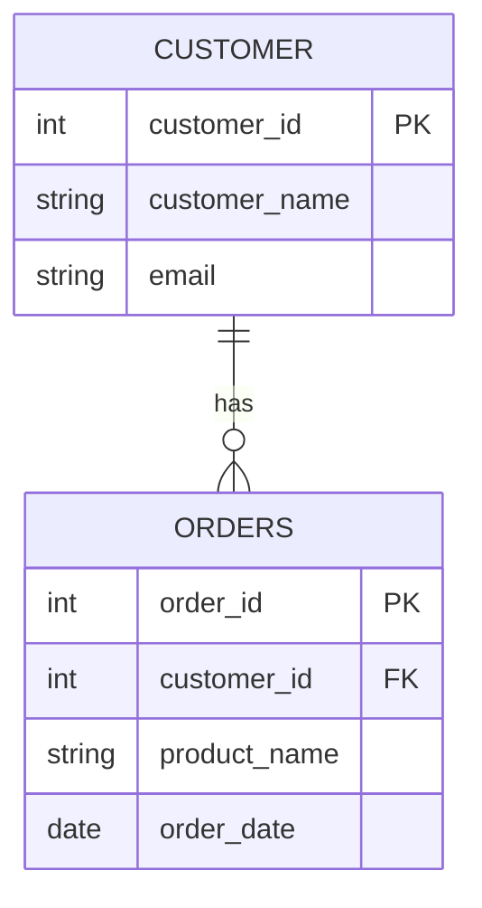
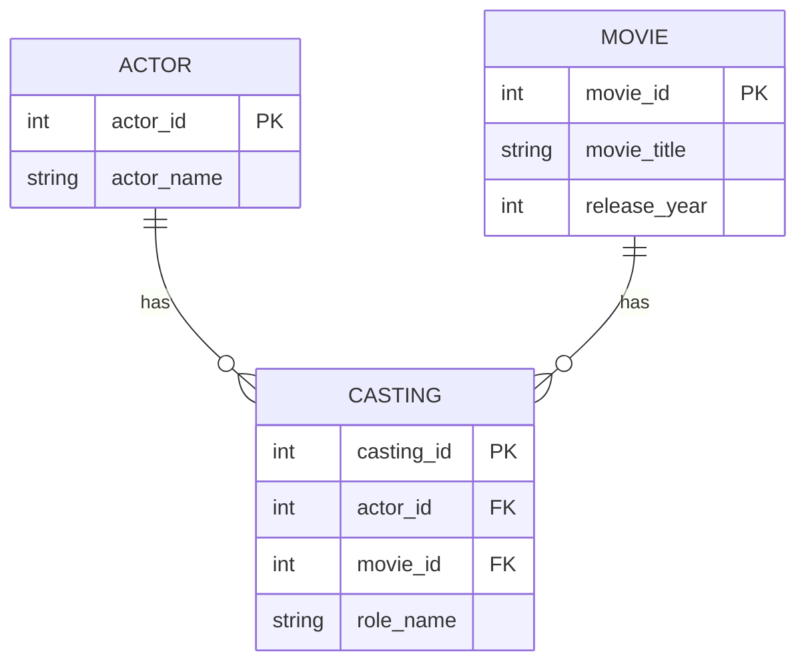
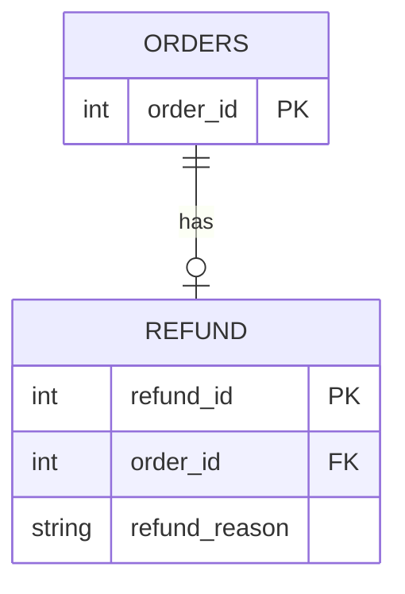

# 2026-10-02_스키마와_ERD(엔티티,_까마귀_발_표기법)
> 작성일: 2026-10-02

## 🔗 관련 글

- [데이터베이스 기초와 관계(RDB, PK/FK, 1:N, M:N)](2026-10-02%20(1)데이터베이스_기초와_관계(RDB,_PK_FK,_1대N,_M대N).md) — 거기서 글과 표로 배운 1:N, M:N, 1:1 관계와 연관 테이블을 여기서는 **그림(ERD)으로** 읽는다. 고객–주문, 배우–영화(출연), 주문–환불 예시가 그대로 다시 나온다.

## ❓ 아직 모르겠는 것

- 레슨에서 낸 연습 중 **주문–환불 ERD의 양쪽 기호**(환불 쪽 `o|`, 주문 쪽 `||`)를 직접 풀어 보지 않았다.

---

## 주제 1: 데이터베이스 스키마

- 데이터베이스 스키마(database schema)는 **테이블, 열, 데이터 타입, 키, 제약 조건 등 데이터베이스의 구조를 정의한 것**이다.
- 데이터가 실제로 저장된 값이라면, 스키마는 그 데이터를 **어떤 구조로 저장할지 정한 것**이다.

### 데이터와 스키마

**고객 테이블**

| 고객ID | 고객이름 | Email |
|---|---|---|
| 1 | 김민준 | minjun@example.com |
| 2 | 이서연 | seoyeon@example.com |
| 3 | 박지호 | jiho@example.com |

| | 무엇인가 | 언제 바뀌나 |
|---|---|---|
| **데이터** | `1, 김민준, minjun@example.com` 등 테이블에 저장된 **실제 값** | 고객이 추가되거나 이메일이 변경되면 바뀐다 |
| **스키마** | 고객 테이블에 `고객ID`, `고객이름`, `Email` 열이 있다는 **정의**<br>`고객ID`는 정수, `고객이름`과 `Email`은 문자열을 저장한다는 **정의**<br>`고객ID`를 기본 키로 사용한다는 **정의** | 열을 추가하거나 기본 키를 변경하면 바뀐다 |

> ➕ **더 알아두기 — 설계도와 건물**
> 스키마는 건물의 **설계도**, 데이터는 건물 안에 들어 있는 **물건**에 비유할 수 있다. 가구(데이터)가 바뀌어도 설계도(스키마)는 그대로이고, 벽을 허물어야(열 추가, 기본 키 변경) 설계도가 바뀐다.

> 📝 **기사 시험 포인트** (정보처리기사)
>
> - **스키마(Schema)** 는 데이터베이스의 구조와 제약 조건에 대한 명세이다. (레슨의 "구조를 정의한 것"과 같은 뜻이다.)
> - 스키마는 보는 관점에 따라 **3계층(3층) 스키마**로 나눈다.
>
> | 스키마 | 관점 |
> |---|---|
> | 외부 스키마 (External) | 개별 사용자나 응용 프로그램이 보는 **일부 논리 구조** |
> | 개념 스키마 (Conceptual) | **전체 데이터베이스**의 논리적 구조 |
> | 내부 스키마 (Internal) | 데이터가 **물리적으로 저장**되는 구조 |
>
> - 오늘 레슨의 스키마는 테이블·열·키·제약 조건 같은 **논리적 구조**를 말하는 것이므로 주로 개념 스키마에 해당한다. 3계층 스키마는 오늘 수업에 나오지 않았고, 수업에서 나오면 보완한다.

---

## 주제 2: ERD

- ERD(Entity-Relationship Diagram)는 **데이터의 구성과 관계를 그림으로 표현한 것**이다.
- **테이블 중심의 ERD**에서는 테이블의 열과 키, 테이블 사이의 관계를 **한눈에** 확인할 수 있다.
- 실제 데이터의 모든 행을 표시하는 것이 아니라, 데이터를 **저장하는 구조**를 보여준다. (스키마를 그림으로 그린 것이라고 볼 수 있다.)

### ERD의 주요 구성 요소

| 구성 요소 | 뜻 | 테이블에서는 | 예 |
|---|---|---|---|
| **엔티티(Entity)** | 데이터를 관리하려는 **대상** | 보통 **테이블**로 표현 | 고객, 주문, 상품 |
| **속성(Attribute)** | 대상이 가지는 **정보** | **열**로 표현 | 고객ID, 고객이름, Email |
| **기본 키(PK)** | 테이블의 각 행을 **고유하게 식별**하는 키 | | |
| **외래 키(FK)** | 다른 테이블 또는 같은 테이블의 기본 키나 고유 키를 **참조**하는 열 또는 열의 조합 | | |
| **관계(Relationship)** | 테이블 사이의 연결을 **선**으로 표현한 것 | | 선 끝의 기호로 연결될 수 있는 행의 수를 나타낸다 |

> ➕ **더 알아두기 — 엔티티와 테이블**
> 레슨은 엔티티를 "보통 테이블로 표현한다"고 하고, 그림 설명에서는 `CUSTOMER`를 "고객 테이블"이라고 부른다. 구분하면 **엔티티는 설계할 때 쓰는 말(관리할 대상), 테이블은 실제 DB에서 그 대상을 저장하는 표**이다. 그래서 ERD의 박스는 개념으로는 엔티티, DB에서는 테이블이다. 실무에서는 두 말을 섞어 쓰는 경우가 많아서 "고객 테이블"이라고 불러도 틀리지 않다.
> 대응 관계: 엔티티 → 테이블, 속성 → 열, 실제 한 건(인스턴스) → 행이다.

> 📝 **기사 시험 포인트** (정보처리기사)
>
> - 정보처리기사의 개념적 설계에서는 **E-R 다이어그램(Peter Chen 표기)** 이 나온다. 대표 기호는 다음과 같다.
>
> | 기호 | 의미 |
> |---|---|
> | 사각형 | 개체(Entity) |
> | 마름모 | 관계(Relationship) |
> | 타원 | 속성(Attribute) |
> | 선(링크) | 개체-관계-속성을 연결하고, 관계의 대응 수(1:N 등)를 표시 |
>
> - 오늘 레슨의 ERD는 박스 안에 열을 나열하는 **테이블 중심 표기**와 **까마귀 발 표기법**이라서, 위 Chen 표기와는 생김새가 다르다. 개체·속성·관계라는 **개념은 같다.**
> - 까마귀 발 표기법이 시험에 그대로 출제되는지는 확인하지 못했다. 확인되면 이 블록에 보완한다.

---

## 주제 3: 고객과 주문의 ERD

- 한 고객은 주문이 **없을 수도 있고**, 여러 건의 주문을 할 수도 있다.
- 각 주문은 **반드시 한 고객**에게 속한다.
- 아래 그림에서 `CUSTOMER`는 고객 테이블, `ORDERS`는 주문 테이블이다.



> 위 그림은 레슨의 ERD 그림을 **텍스트 설명에 맞춰 다시 그린 것**이다. 레슨 원본 그림과 모양이 조금 다를 수 있다.

- `CUSTOMER.customer_id`는 고객 테이블의 **기본 키**이다.
- `ORDERS.order_id`는 주문 테이블의 **기본 키**이다.
- `ORDERS.customer_id`는 고객 테이블의 `customer_id`를 참조하는 **외래 키**이다.
- `int`, `string`, `date`는 각각 **정수, 문자열, 날짜**를 나타낸다.
- 이 그림에서는 데이터 종류를 간단히 표시한 것이며, **실제 SQL의 타입 이름은 사용하는 DBMS에 따라 달라질 수 있다.**

---

## 주제 4: 관계선 읽기 — 까마귀 발 표기법

- 까마귀 발 표기법(Crow's Foot Notation)은 **관계선 끝의 기호로 연결 가능한 행의 수**를 나타낸다.

### 고객과 주문의 ERD에서

- 고객 한 명이 주문을 몇 건 할 수 있는지 알려면 **주문 테이블 쪽의 기호**를 확인한다.
  - 주문 쪽의 `o{`: 고객 한 명에 연결되는 주문은 **없거나 여러 건**이다.
- 주문 한 건이 몇 명의 고객에게 속하는지 알려면 **고객 테이블 쪽의 기호**를 확인한다.
  - 고객 쪽의 `||`: 주문 한 건에 연결되는 고객은 **반드시 한 명**이다.
- 따라서 고객과 주문은 **1:N 관계**이며, **고객의 주문은 선택적이고 주문의 고객은 필수**이다.

### 레슨에 나온 기호

| 기호 | 의미 | 레슨에서 쓰인 곳 |
|---|---|---|
| `\|\|` | 반드시 **하나** | 고객 쪽 |
| `o{` | **없거나 여러 개** | 주문 쪽 |
| `o\|` | **없거나 하나** | 환불 쪽 |

> ➕ **더 알아두기 — 기호는 외우지 않고 읽는다**
> (수업에 없던 읽는 법이다. 대화 중 정리했다.)
>
> 기호는 글자 두 개로 이루어지고, **(최소, 최대)** 로 읽는다.
>
> | 위치 | 뜻 | 글자 |
> |---|---|---|
> | 선 쪽 글자 | **최소** 몇 개? | `o` = 0개(없어도 됨), `\|` = 1개(반드시 있음) |
> | 테이블 쪽 글자 | **최대** 몇 개? | `\|` = 1개까지, `{` = 여러 개 |
>
> | 기호 | 최소 | 최대 | 읽으면 |
> |---|---|---|---|
> | `o{` | 0 | 여러 개 | 없을 수도, 여러 개일 수도 |
> | `\|\|` | 1 | 1 | 반드시 딱 하나 |
> | `o\|` | 0 | 1 | 없거나 하나 |
> | `\|{` | 1 | 여러 개 | 하나 이상 (레슨에는 안 나왔다) |
>
> 외울 것은 **`o` = 0, `|` = 1, `{` = 여러 개** 세 가지뿐이고, 조합은 규칙대로 읽으면 된다.
>
> **기호는 "가장 가까운 테이블"의 행 수를 말하고, 그 개수는 "반대편 테이블의 한 행"을 기준으로 센 것이다.**
>
> ```
> CUSTOMER ||──────o{ ORDERS
> ```
>
> - `o{`는 가장 가까운 `ORDERS`의 행 수이고, 기준은 반대편 `CUSTOMER`의 한 행이다. → "**고객 한 명당** 주문이 0건 이상"
> - `||`는 가장 가까운 `CUSTOMER`의 행 수이고, 기준은 반대편 `ORDERS`의 한 행이다. → "**주문 한 건당** 고객이 정확히 1명"
>
> 읽을 때는 항상 **"이쪽 하나에 저쪽은 최소 몇 개, 최대 몇 개?"** 를 양쪽에서 각각 묻는다.
>
> 앞에서 배운 1:N, M:N, 1:1은 **최대**만 본 것이고, 이번 레슨에서 새로 생긴 것은 **최소(필수/선택)** 이다. 또 1:N에서 **FK는 N쪽**(여러 개 쪽)에 있으므로, `o{`가 붙은 `ORDERS`에 FK(`customer_id`)가 있다.

> ➕ **더 알아두기 — ERD 읽는 순서**
> ① PK/FK로 **연결 고리**를 찾는다 → ② 선 끝 기호로 **개수와 필수/선택**을 읽는다 → ③ `has` 같은 이름표는 **참고**한다.

---

## 주제 5: M:N 관계 읽기

- 배우 한 명은 여러 영화에 출연할 수 있고, 영화 한 편에는 여러 배우가 출연할 수 있다.
- 배우와 영화 사이에 **출연 테이블**을 두어 **두 개의 1:N 관계**로 표현한다.



> 위 그림도 레슨 그림을 텍스트 설명에 맞춰 다시 그린 것이다. 레슨 텍스트에는 이 그림의 기호가 직접 적혀 있지 않고 "출연 정보가 아직 없는 배우나 영화도 저장할 수 있다고 가정한다"는 설명만 있어서, 이에 맞게 `||--o{`로 그렸다.

- `ACTOR`는 배우, `MOVIE`는 영화, `CASTING`은 **출연 테이블**이다.
- 출연 테이블의 각 행은 **배우 한 명과 영화 한 편을 연결**한다.
- 배우와 영화의 **기본 키가 출연 테이블에 외래 키로** 들어간다.
- 이 그림에서는 출연 정보가 아직 없는 배우나 영화도 저장할 수 있다고 **가정**한다.

> 앞 TIL에서 본 출연 테이블과 같다. `casting_id`가 자기 PK, `actor_id`와 `movie_id`가 FK, `role_name`이 일반 열이다.

---

## 주제 6: 1:1 관계 읽기

- **주문당 환불은 최대 한 번만 가능**하다고 가정한다.
- 주문은 환불이 없거나 하나 있고, 각 환불은 **반드시 주문 하나에 속한다.**



- `REFUND`는 환불 테이블이다.
- 환불 쪽의 `o|`는 주문 한 건에 환불이 **없거나 하나** 있음을 나타낸다.

---

## 주제 7: ERD와 데이터 함께 읽기

1. ERD에서 **기본 키와 외래 키**를 확인한다.
2. 관계선 양쪽의 **기호**를 보고 연결 가능한 행의 수를 확인한다.
3. 실제 테이블에서는 **외래 키와 참조하는 키의 값이 같은 행**을 연결해 읽는다.

- 예: 고객ID가 1인 고객과 고객ID가 1인 주문들을 연결하면, **김민준의 주문**을 확인할 수 있다.

---

## 주제 8: `has`와 관계의 주체

레슨 본문은 그림에 적힌 `has`를 설명하지 않았다. 그림에 `has`가 있어서 대화 중에 다뤘고, 그 과정에서 강사님 설명을 확인했다.

- 강사에 따르면 관계의 주체는 **대부분 1쪽의 입장에서 표현**한다. (예: 고객이 주문을 가진다. 1쪽은 고객이다.)

> ➕ **더 알아두기 — `has`는 무엇이고 주체는 누구인가**
>
> - ERD의 관계선 위에 적힌 `has`는 두 테이블이 **어떤 관계인지 말로 설명하는 이름표**이다. 레슨 본문은 이를 따로 설명하지 않았다.
> - 이름표는 **사람이 읽기 편하도록 붙인 설명**이라서, 몇 개 연결되는지, 어느 쪽이 FK를 갖는지, 누가 누구를 가지는지(방향)는 이름표만으로는 알 수 없다. 진짜 정보는 **선 끝의 기호, PK, FK**에 있다.
> - `has`의 주체는 **PK가 있는 쪽(1쪽, 부모)** 이고, **FK가 있는 쪽(N쪽, 자식)** 이 속하는 쪽이다. FK는 "나는 누구에게 속해 있다"를 가리키는 열이기 때문이다.
>   - `ORDERS.customer_id`가 FK → "고객이 주문을 가진다"
>   - `CASTING.actor_id`, `CASTING.movie_id`가 FK → "배우가 출연을 가진다", "영화가 출연을 가진다"
>   - `REFUND.order_id`가 FK → "주문이 환불을 가진다"
> - 적용 범위: 1:N은 1쪽이 주체이고, M:N은 양쪽이 각각 연관 테이블의 1쪽이며, 1:1은 양쪽이 모두 1이라서 **FK가 어디에 있는지**로 판단한다. 그래서 "1쪽"보다 **"PK 쪽이 주체"** 로 기억하는 것이 모든 경우에 통한다.
> - 관계선 이름표는 글자 순서대로 읽으면 뜻이 거꾸로 되는 경우도 있으므로(예: `CASTING`이 `MOVIE`를 가진다고 읽히는 경우) 방향은 이름표를 믿지 말고 PK/FK로 확인한다.
> - 강사님의 "대부분 1쪽의 입장에서 표현한다"는 설명은 위의 "PK 쪽이 주체"와 같은 말이다. 1:N에서 1쪽이 PK 쪽(부모)이기 때문이다. "대부분"이라는 표현대로 이것은 절대 규칙이 아니라 **관례**이므로, 1:1처럼 1쪽으로 구분이 안 되는 경우에는 PK/FK로 확인한다.

---

## 정리

- **스키마**는 테이블, 열, 데이터 타입, 키, 제약 조건 등 DB의 **구조 정의**이고, **데이터**는 실제로 저장된 값이다. 열 추가나 기본 키 변경은 스키마를, 고객 추가나 이메일 변경은 데이터를 바꾼다.
- **ERD**는 데이터의 구성과 관계를 그림으로 표현한 것이다. 실제 행은 표시하지 않고 **구조**를 보여준다.
- ERD의 구성 요소는 **엔티티(테이블), 속성(열), PK, FK, 관계(선)** 이다.
- **까마귀 발 표기법**은 관계선 끝의 기호로 연결 가능한 행의 수를 나타낸다.
  - `||` 반드시 하나, `o{` 없거나 여러 개, `o|` 없거나 하나
  - 고객–주문: `||`──`o{`, **1:N**, 고객의 주문은 선택적이고 주문의 고객은 필수
- **M:N**은 연관 테이블(출연)을 두어 두 개의 1:N으로, **1:1**은 `o|`로 표현한다(주문–환불).
- ERD를 읽을 때는 **PK/FK → 기호 → 이름표** 순서로 읽고, 실제 데이터에서는 FK와 참조하는 키의 값이 같은 행을 연결한다.
- (수업 외) 기호는 **(최소, 최대)** 로 읽고, `o` = 0, `|` = 1, `{` = 여러 개이다. 기호는 가장 가까운 테이블의 행 수를 반대편 한 행 기준으로 센 것이다. `has`의 주체는 PK 쪽이다.

---

## ✅ 확인 질문

1. 데이터와 스키마의 차이를 설명하라. 각각이 바뀌는 상황의 예를 하나씩 들어 보라.
2. 고객 테이블에 `전화번호` 열을 추가하면 데이터와 스키마 중 무엇이 바뀌는가? 고객 한 명이 새로 가입하면 어떤가?
3. ERD는 무엇을 보여주고 무엇을 보여주지 않는가?
4. ERD의 구성 요소 5가지는 무엇이며, 각각 테이블에서 무엇에 해당하는가?
5. 엔티티와 테이블은 어떤 관계이며, 어떤 상황에서 각각의 말을 쓰는가?
6. 고객–주문 ERD에서 PK와 FK는 각각 어느 열인가? `ORDERS.customer_id`가 FK인 이유는?
7. 까마귀 발 표기법의 `o`, `|`, `{`는 각각 무엇을 뜻하는가? `o{`와 `o|`의 차이는?
8. 관계선의 기호는 어느 테이블의 행 수를 말하고, 무엇을 기준으로 센 것인가?
9. 고객–주문 ERD를 "선택/필수"를 넣어 말로 풀어 쓰면?
10. M:N 관계를 ERD에서 어떻게 표현하는가? 출연 테이블에서 PK, FK, 일반 열은 각각 무엇인가?
11. 주문–환불 ERD에서 환불 쪽 기호가 `o|`인 이유는? 주문 쪽 기호는 무엇이어야 하는가?
12. 관계선의 `has` 이름표만으로는 알 수 없는 것은 무엇이고, 그것은 어디서 알 수 있는가?
13. "A가 B를 가진다"에서 주체를 PK/FK로 판단하는 방법은? 1:1에서는 어떻게 판단하는가?
14. ERD와 실제 데이터를 함께 읽어 "김민준의 주문"을 찾으려면 어떻게 하는가?
15. (기사 대비) 3계층 스키마는 무엇이며, 각각 어떤 관점인가?
