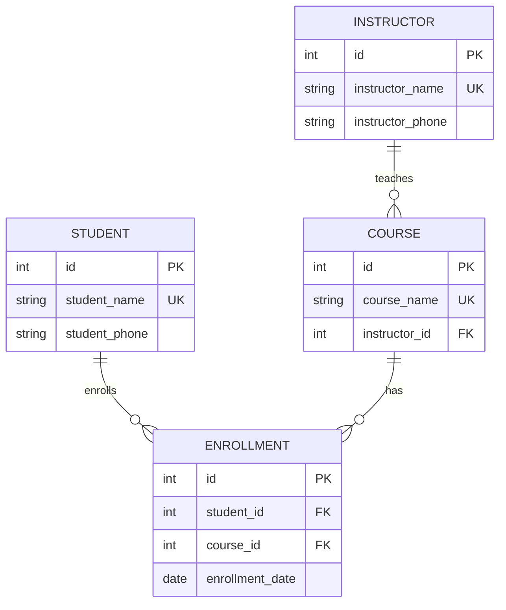

# 2026-10-07_데이터베이스_설계(키,_무결성,_정규화,_ERD_작성)
> 작성일: 2026-10-07

## 🔗 관련 글

- [데이터베이스 기초와 관계(RDB, PK/FK, 1:N, M:N)](2026-10-02%20(1)데이터베이스_기초와_관계(RDB,_PK_FK,_1대N,_M대N).md) — 10월 2일에 **대화 중 보충**으로 정리한 정규화(1NF·2NF·3NF, 부분·이행 함수 종속, 이상 현상)가 이 레슨에서 **정식 수업 내용**으로 나왔다. 기본키·외래키, 연관 테이블, 1:N·M:N·1:1도 거기서 배웠다.
- [스키마와 ERD](2026-10-02%20(2)스키마와_ERD(엔티티,_까마귀_발_표기법).md) — ERD의 구성 요소, 까마귀 발 표기법. 이 레슨의 수강신청 ERD를 읽는 데 쓴다.
- [SQL 기초와 DDL](2026-10-02%20(4)SQL_기초와_DDL(명령어_분류,_트랜잭션,_제약조건).md) — 무결성 3종(개체·참조·도메인)을 `PRIMARY KEY`, `FOREIGN KEY`, `CHECK`, `NOT NULL`과 짝지은 표가 거기 `📝`에 있었고, 이 레슨의 "데이터 무결성"과 같은 내용이다.

## ❓ 아직 모르겠는 것

- **ERD 실습**(가수·노래·음반, 도서관 플랫폼)은 아직 하지 않았다.
- 후보키의 **최소성**을 직접 판단하는 연습(어떤 컬럼 조합이 후보키인가)은 하지 않았다.
- 수강신청 ERD의 관계선 이름표(`enrolls`, `has`, `teaches`)가 **어느 선에 붙는지**는 레슨 텍스트에 순서만 나와서, 아래 다시 그린 ERD는 추정이다.

---

## 주제 1: 데이터베이스 설계란

- **요구사항을 바탕으로 필요한 데이터와 데이터 사이의 관계를 정한다.**
- **개체, 속성, 키, 관계**를 설계하고 **ERD로 표현**한다.

---

## 주제 2: 키(Key)

- **키(Key)** 는 **행을 식별하거나 테이블 사이의 관계를 연결**하는 데 사용하는 **컬럼 또는 컬럼의 조합**이다.
- 수강신청 예제에서는 **학생이 같은 강좌에 한 번만 신청할 수 있다**고 가정한다.

### 후보키 (Candidate Key)

각 행을 **유일하게 구분**할 수 있는 **최소한의 컬럼 조합**이다.

- **유일성**: 키 값이 같은 행이 둘 이상 존재하지 않는다.
- **최소성**: 구성 컬럼을 하나라도 빼면 행을 유일하게 구분할 수 없다.
- 수강신청에서 학생ID나 강좌ID **하나만으로는** 행을 구분할 수 없지만, **(학생ID, 강좌ID)를 함께** 사용하면 구분할 수 있으므로 후보키가 된다.

### 기본키 (Primary Key)

- 후보키 중 각 행을 식별하는 **대표로 선택한 키**이다.
- **중복과 NULL을 허용하지 않는다.**
- 예: 학생 테이블과 수강신청 테이블의 정수형 `id`

### 복합키 (Composite Key)

- **두 개 이상의 컬럼으로 구성된 키**이다.
- 수강신청의 (학생ID, 강좌ID)를 기본키로 선택하면 **복합 기본키**가 된다.
- 복합 기본키에서는 **각 컬럼의 값이 반복될 수 있지만, 전체 조합은 중복될 수 없다.**

### 외래키 (Foreign Key)

- **다른 테이블 또는 같은 테이블의 기본키나 고유 키를 참조**하는 컬럼 또는 컬럼의 조합이다.
- **테이블 사이의 관계를 연결**한다.
- 예: 수강신청의 학생ID는 학생 테이블의 id를, 강좌ID는 강좌 테이블의 id를 참조한다.

> ➕ **더 알아두기 — 키를 한 표로 정리**
> (수업 내용을 비교하기 쉽게 표로 묶은 것이다.)
>
> | 키 | 한 줄 정의 | 핵심 조건 |
> |---|---|---|
> | 후보키 | 행을 유일하게 구분하는 **최소** 컬럼 조합 | 유일성 + **최소성** |
> | 기본키 | 후보키 중 **대표**로 선택한 것 | 중복·NULL 불가 |
> | 복합키 | 컬럼 **2개 이상**으로 된 키 | 조합 전체가 유일 |
> | 외래키 | 다른(또는 같은) 테이블의 PK·고유 키를 **참조** | 테이블 관계 연결 |
>
> 후보키는 "대표를 뽑기 **전**의 후보들", 기본키는 "그중 뽑힌 대표"라고 이해하면 된다. 후보키가 여러 개일 수 있다는 점이 핵심이며, 예를 들어 레슨의 가정(학생명에 동명이인이 없다)에서는 학생 테이블의 `id`와 `학생명`이 모두 행을 유일하게 구분하므로 둘 다 후보키가 될 수 있고, 그중 `id`를 기본키로 고른 것이다.

> 📝 **기사 시험 포인트** (정보처리기사, 확실도: 높음)
> 키의 종류로 **후보키(유일성·최소성), 기본키, 외래키**가 출제되는 것으로 알고 있다. 수업에 나오지 않은 **슈퍼키**(유일성만 만족, 최소성은 요구하지 않음)와 **대체키**(후보키 중 기본키로 선택되지 않은 것)도 함께 외워 두는 것이 좋다. (확실도: 높음, 수업 외)

---

## 주제 3: 데이터 무결성

- **데이터 무결성(Data Integrity)** 은 데이터의 **정확성과 일관성이 유지되는 성질**이다.
- **키와 제약조건**을 사용해 잘못된 데이터가 저장되는 것을 막는다.

### 개체 무결성

- **기본키는 중복되거나 NULL일 수 없다.**
- 예: 학생 테이블의 id는 반드시 값이 있어야 하며, 다른 학생과 중복될 수 없다.
- **`PRIMARY KEY` 제약조건**으로 보장한다.

### 참조 무결성

- **외래키 값은 참조 대상에 존재해야 한다.**
- 예: 수강신청의 학생ID는 학생 테이블에 존재하는 id 값이어야 한다.
- **`FOREIGN KEY` 제약조건**으로 보장한다. **NULL 허용 여부는 별도로 정하며, 반드시 연결되어야 하는 컬럼에는 `NOT NULL`을 지정한다.**

### 도메인 무결성

- **각 컬럼에는 정해진 타입과 허용 범위에 맞는 값만 저장**한다.
- 예: 수강료는 0 이상의 정수여야 한다.
- **데이터 타입과 `CHECK`, `NOT NULL` 등의 제약조건**으로 보장한다.

| 무결성 | 뜻 | 보장하는 제약조건 |
|---|---|---|
| 개체 무결성 | 기본키는 중복·NULL 불가 | `PRIMARY KEY` |
| 참조 무결성 | 외래키 값은 참조 대상에 존재 | `FOREIGN KEY` (+ 필수면 `NOT NULL`) |
| 도메인 무결성 | 컬럼은 정해진 타입·범위의 값만 | 데이터 타입, `CHECK`, `NOT NULL` |

> ➕ **더 알아두기 — 이전에 정리한 내용과 연결**
> 10월 2일 [SQL 기초와 DDL](2026-10-02%20(4)SQL_기초와_DDL(명령어_분류,_트랜잭션,_제약조건).md)의 `📝`에 정리한 무결성 3종 표가 **수업 내용과 일치**한다. 또 "FK에 `NOT NULL`을 붙이면 ERD의 **필수 관계**, NULL을 허용하면 **선택 관계**"로 연결한 설명이 레슨의 "반드시 연결되어야 하는 컬럼에는 `NOT NULL`을 지정한다"와 같은 이야기이다.

> 📝 **기사 시험 포인트** (정보처리기사, 확실도: 높음)
> **무결성 제약 조건의 3종류(개체·참조·도메인)** 는 시험 단골 주제로 알고 있다. 참조 무결성은 "외래 키 값은 참조하는 테이블에 존재하는 값이거나 NULL"로 정의되는 것으로 알고 있으며, 수업의 "NULL 허용 여부는 별도로 정한다"와 같은 뜻이다. 정확한 정의는 시험 교재 표현을 확인한다.

---

## 주제 4: 정규화

- **정규화(Normalization)** 는 **테이블을 나누어 불필요한 중복과 이상 현상을 줄이는 과정**이다.
- 아래 예제의 가정
  - 학생이 같은 강좌에 **한 번만** 신청할 수 있고, 강좌마다 **담당 강사가 한 명**이다.
  - 학생과 강사는 각각 **동명이인이 없고 연락처가 하나**이며, **강좌명도 중복되지 않는다.**

### 중복으로 발생하는 이상 현상

수강신청 내역을 **한 테이블에** 저장한 경우이다.

| 학생명 | 학생연락처 | 강좌명 | 강사명 | 강사연락처 | 신청일 |
|---|---|---|---|---|---|
| 김민준 | 010-1111-1111 | 파이썬 | 이지수 | 010-0000-0000 | 2026-03-01 |
| 김민준 | 010-1111-1111 | SQL | 이지수 | 010-0000-0000 | 2026-03-02 |
| 이서연 | 010-2222-2222 | 파이썬 | 이지수 | 010-0000-0000 | 2026-03-03 |

| 이상 | 상황 |
|---|---|
| **수정 이상** | 강사연락처를 **일부 행에서만** 수정하면 같은 강사의 연락처가 달라진다. |
| **삽입 이상** | **신청자가 없는 새 강좌만** 저장하기 어렵다. |
| **삭제 이상** | SQL의 **유일한 신청 기록을 삭제**하면 강좌 정보도 사라진다. |

### 제1정규형 (1NF)

- **각 칸에는 하나의 값**을 저장한다.
- 강좌명에 파이썬, SQL을 함께 넣는 대신, **신청한 강좌마다 행을 나눈다.**

| 학생명 | 강좌명 |
|---|---|
| 김민준 | 파이썬 |
| 김민준 | SQL |

- **처음 제시한 수강신청 테이블은 이미 1NF를 만족**한다.

### 제2정규형 (2NF)

- **1NF을 만족하고, 후보키의 일부만으로 결정되는 일반 속성을 분리**한다.
- **일반 속성**은 **어떤 후보키에도 포함되지 않는 속성**이다.
- 원본에서는 **(학생명, 강좌명)이 후보키**이며, **학생연락처는 학생명만으로**, **강사명과 강사연락처는 강좌명만으로** 결정된다.
- 학생·강좌·수강신청 테이블로 나누고, 각 테이블의 **기본키로 정수형 `id`** 를 부여한다.
- **id 부여 자체가 2NF의 조건은 아니며**, 학생명과 강좌명에는 **`UNIQUE NOT NULL`** 제약조건을 유지한다.

**학생 테이블** — 기본키: `id` (INT)

| id | 학생명 | 학생연락처 |
|---|---|---|
| 1 | 김민준 | 010-1111-1111 |
| 2 | 이서연 | 010-2222-2222 |

**강좌 테이블** — 기본키: `id` (INT)

| id | 강좌명 | 강사명 | 강사연락처 |
|---|---|---|---|
| 1 | 파이썬 | 이지수 | 010-0000-0000 |
| 2 | SQL | 이지수 | 010-0000-0000 |

**수강신청 테이블** — 기본키: `id` (INT)

| id | 학생ID | 강좌ID | 신청일 |
|---|---|---|---|
| 1 | 1 | 1 | 2026-03-01 |
| 2 | 1 | 2 | 2026-03-02 |
| 3 | 2 | 1 | 2026-03-03 |

- `학생ID`와 `강좌ID`는 각각 학생·강좌 테이블의 `id`를 참조하는 **정수형 외래키**이다.
- **(학생ID, 강좌ID)에는 복합 `UNIQUE` 제약조건**을 두어 중복 신청을 막고, **두 컬럼 모두 `NOT NULL`** 로 지정한다.
- **신청일은 학생과 강좌의 조합으로 결정**되므로 수강신청에 둔다.

### 제3정규형 (3NF)

- **2NF을 만족하고, 일반 속성이 다른 일반 속성을 거쳐 결정되는 구조를 분리**한다.
- 예: 강좌의 `id`로 담당 강사명이 정해지고, 강사명으로 강사연락처가 정해진다.
- 같은 강사가 여러 강좌를 맡으면 연락처가 반복되므로, **강사명과 강사연락처를 별도 강사 테이블로 분리**한다.
- 강사 테이블의 기본키로 정수형 `id`를 부여하고, 강사명에는 `UNIQUE NOT NULL` 제약조건을 둔다.
- 강좌 테이블에는 정수형 외래키인 **강사ID**를 두어 강사 테이블의 `id`를 참조한다.
- 학생·수강신청 테이블은 2NF에서 나눈 구조를 유지한다.

**강사 테이블** — 기본키: `id` (INT)

| id | 강사명 | 강사연락처 |
|---|---|---|
| 1 | 이지수 | 010-0000-0000 |

**강좌 테이블** — 기본키: `id` (INT)

| id | 강좌명 | 강사ID |
|---|---|---|
| 1 | 파이썬 | 1 |
| 2 | SQL | 1 |

- 강사연락처가 바뀌면 **강사 테이블의 한 행만 수정**하면 된다.

### 함수적 종속

- 앞의 예제에서는 **어떤 값이 다른 값을 결정하는지** 살펴보고 테이블을 나누었다.
- 이처럼 **A 값이 정해지면 B 값이 하나로 결정되는 관계**를 **함수적 종속**이라고 하며, **A → B**로 표시한다.
- ID를 부여하기 전 예: `학생명 → 학생연락처`, `강좌명 → 강사명, 강사연락처`
- 2NF에서 분리한 학생연락처처럼 **후보키의 일부만으로 결정되는 것**을 **부분 함수적 종속**이라고 한다.
- 3NF에서 분리한 강사연락처처럼 강좌 테이블의 `id → 강사명 → 강사연락처`로 이어지는 것을 **이행적 함수적 종속**이라고 한다.

> ➕ **더 알아두기 — 정규화 한눈에, 그리고 이전 정리와 연결**
> (표는 수업 내용을 비교하기 쉽게 묶은 것이다.)
>
> | 단계 | 없애는 것 | 이 예제에서 분리된 것 |
> |---|---|---|
> | 1NF | 한 칸에 여러 값 | (원본은 이미 만족) |
> | 2NF | **부분 함수적 종속** (후보키 일부로 결정되는 속성) | 학생연락처 → 학생 테이블, 강사 정보 → 강좌 테이블 |
> | 3NF | **이행적 함수적 종속** (일반 속성을 거쳐 결정) | 강사명·강사연락처 → 강사 테이블 |
>
> - 10월 2일 [데이터베이스 기초와 관계](2026-10-02%20(1)데이터베이스_기초와_관계(RDB,_PK_FK,_1대N,_M대N).md)의 "주제 9: 정규화"에서 대화 중 정리한 **"2NF = 복합 PK의 일부에만 의존하는 열 분리, 3NF = 다른 일반 열을 거치는 의존 분리"** 가 수업의 정의와 일치한다. 그때 쓴 시험 용어(**부분 함수 종속**, **이행 함수 종속**)도 수업에서 같은 표현으로 나왔다.
> - 수강 테이블에 `학생이름`을 넣으면 2NF 위반이라는 연습 문제의 답도, 이 레슨의 "학생연락처는 학생명(후보키의 일부)만으로 결정된다"와 같은 구조이다.
> - **정규화(구조 분리)와 id 부여는 별개이다.** 수업이 "id 부여 자체가 2NF의 조건은 아니다"라고 짚은 것처럼, id는 키를 편하게 쓰려고 붙인 **인공 키**이고 원래 컬럼(학생명, 강좌명)의 유일성은 `UNIQUE NOT NULL`로 유지한다.
> - 이상 현상 3가지(수정·삽입·삭제)는 시험에서 갱신 이상, 삽입 이상, 삭제 이상으로 불린다.

> 📝 **기사 시험 포인트** (정보처리기사, 확실도: 높음)
> - **이상(Anomaly) 현상**: **삽입 이상, 삭제 이상, 갱신(수정) 이상**
> - **정규형별 제거 대상**: 1NF 비원자값, **2NF 부분 함수 종속**, **3NF 이행 함수 종속**. 수업에 나오지 않은 **BCNF**(결정자이면서 후보키가 아닌 종속 제거), 4NF(다치 종속), 5NF(조인 종속)도 시험에서 단계로 거론되는 것으로 알고 있다. (확실도: 중간, 수업 외)
> - **함수적 종속**: A → B 표기와 **완전/부분/이행** 함수 종속의 구분을 외운다.

---

## 주제 5: 반정규화

- **반정규화(Denormalization)** 는 **조회 성능 등을 위해 의도적으로 데이터를 중복 저장**하는 것이다.
- 예: 신청 인원을 매번 집계하는 대신, **강좌별 신청 인원을 별도로 저장**한다.
- 조회는 간단해질 수 있지만, **신청·취소 시 집계 값도 함께 갱신**해야 한다.
- **정규화한 구조를 기본**으로 하고, **성능상 필요가 확인되면** 반정규화를 검토한다.

> ➕ **더 알아두기 — 반정규화는 거래(trade-off)이다**
> 정규화는 **중복을 줄여 수정·삽입·삭제 이상을 막는** 대신 조회할 때 **JOIN이 늘어난다.** 반정규화는 반대로 **조회를 빠르고 단순하게** 하는 대신 **같은 정보가 여러 곳에 있어서 함께 갱신해야 한다**(안 하면 값이 어긋나는 위험). "정규화가 기본, 필요가 확인되면 반정규화"라는 순서가 중요하다. 앞에서 배운 인덱스도 조회를 빠르게 하는 대신 변경 비용이 늘어나는 **비슷한 거래**였다. ([Index 글](2026-10-07%20(4)Index(검색_속도,_B-tree,_카디널리티).md))

> 📝 **기사 시험 포인트** (정보처리기사, 확실도: 높음)
> **반정규화**는 정규화된 데이터 모델을 **성능(조회)을 위해 의도적으로 통합·중복**하는 것으로 알고 있다. 정규화의 반대 방향이 아니라 **정규화를 한 뒤에 필요에 따라** 선택하는 것이라는 점이 핵심이다.

---

## 주제 6: ERD 작성 순서

### 1. 사전 준비 및 요구사항 분석

- 서비스의 **비즈니스 규칙**을 정리한다.
  - 예: 학생은 여러 강좌를 신청할 수 있지만, 같은 강좌에는 한 번만 신청할 수 있다.
- 사용자가 서비스를 이용하는 과정을 **시나리오**로 작성한다.
  - 예: 회원가입 → 강좌 검색 → 수강 신청

### 2. 개체 도출 및 개념적 설계

- 요구사항에서 **학생, 강좌, 강사**처럼 관리할 대상을 찾는다.
- 대상 사이의 **관계를 연결**한다.
  - 예: 학생이 강좌를 신청하고, 강사가 강좌를 담당한다.

### 3. 상세 설계 및 논리적 모델링

- 각 개체에 **필요한 속성과 기본키**를 정한다.
  - 예: 학생의 id, 이름, 연락처 / 강좌의 id, 강좌명, 강사ID
- 관계를 **1:1, 1:N, M:N으로 구분**하고 **외래키를 정한다.**
- **M:N 관계는 연관 테이블로 표현**한다.
  - 예: 학생과 강좌 사이에 **수강신청 테이블**을 두고 신청일을 저장한다.

### 4. 데이터 정규화

- 데이터 사이의 **종속 관계를 확인**하고 불필요한 중복을 줄인다.
- **분리한 테이블과 관계를 ERD에 반영**한다.

> 📝 **기사 시험 포인트** (정보처리기사, 확실도: 중간)
> 데이터베이스 설계 단계는 보통 **요구사항 분석 → 개념적 설계 → 논리적 설계 → 물리적 설계 → 구현**으로 구분하는 것으로 알고 있다. 수업의 "개체 도출 및 개념적 설계", "상세 설계 및 논리적 모델링"이 이 흐름과 이어진다. 물리적 설계(저장 구조, 인덱스 설계 등)는 수업에 나오지 않았다. 시험에서 개념적 설계의 산출물로 E-R 다이어그램이 거론되는 것으로 알고 있다. (출제 범위는 확인하지 못했다.)

---

## 주제 7: 수강신청 ERD

- 앞에서 정규화한 **학생, 강좌, 강사, 수강신청** 테이블을 ERD로 표현한다.
- **학생과 강좌는 신청 기록이 없어도 저장**할 수 있고, **강사는 담당 강좌가 없어도 저장**할 수 있다고 가정한다.
- **각 강좌에는 담당 강사가 반드시 한 명** 있고, **각 수강신청은 학생 한 명과 강좌 하나에 연결**된다.

> 위 그림은 레슨의 ERD 그림을 **텍스트 설명에 맞춰 다시 그린 것**이다. 관계선의 이름표(`enrolls`, `has`, `teaches`)가 어느 선에 붙는지는 레슨 텍스트에 순서만 나와 있어서 추정으로 붙였고, 기호는 위 가정(없어도 저장 가능 = `o{`, 반드시 한 명 = `||`)에 맞췄다.

- `STUDENT`는 학생, `COURSE`는 강좌, `INSTRUCTOR`는 강사, `ENROLLMENT`는 수강신청 테이블이다.
- **모든 테이블의 기본키는 정수형 `id`** 이며, 외래키도 정수형으로 지정한다.
- 수강신청의 **(`student_id`, `course_id`)에는 복합 `UNIQUE` 제약조건**을 적용해 같은 학생의 중복 신청을 막는다.
- 수강신청의 `student_id`와 `course_id`는 각각 학생과 강좌 테이블의 `id`를 참조한다.
- 강좌의 `instructor_id`는 강사 테이블의 `id`를 참조하는 외래키이다.
- **`UK`는 고유 키**를 나타내며, 예제에서는 학생명·강좌명·강사명의 중복을 막는다.

> ➕ **더 알아두기 — ERD 읽기**
> (10월 2일 [스키마와 ERD](2026-10-02%20(2)스키마와_ERD(엔티티,_까마귀_발_표기법).md)에서 배운 읽는 법을 적용한 것이다.)
>
> | 관계선 | 읽는 법 |
> |---|---|
> | `STUDENT ||--o{ ENROLLMENT` | 수강신청 한 건은 **반드시 학생 한 명**에 속하고, 학생은 신청이 **없거나 여러 건** |
> | `COURSE ||--o{ ENROLLMENT` | 수강신청 한 건은 **반드시 강좌 하나**에 속하고, 강좌는 신청이 **없거나 여러 건** |
> | `INSTRUCTOR ||--o{ COURSE` | 강좌 한 개는 **반드시 강사 한 명**이 담당하고, 강사는 담당 강좌가 **없거나 여러 개** |
>
> - `ENROLLMENT`가 **연관 테이블**이다. 학생과 강좌는 M:N 관계인데, 수강신청이 두 개의 1:N으로 풀어 준다. (FK 두 개 + 일반 열 `enrollment_date`)
> - **FK가 있는 쪽이 N쪽(자식)** 이다. `ENROLLMENT`에 FK 두 개, `COURSE`에 `instructor_id`가 있다.
> - `ENROLLMENT.student_id`, `course_id`가 `NOT NULL`이므로 "각 수강신청은 학생 한 명과 강좌 하나에 연결"되는 **필수 관계**가 된다. 강사 쪽 선(`INSTRUCTOR ||--o{ COURSE`)의 `instructor_id`도 필수이면 `NOT NULL`을 지정한다.
> - 수강신청의 기본키로 별도 `id`를 두었으므로 [JOIN 글](2026-10-06%20(2)JOIN(INNER,_LEFT,_FULL,_ON과_WHERE).md)의 출연 테이블(`casting_id`)처럼 **연관 테이블이 자기만의 PK를 갖는 방식**이다. 이 경우 같은 (학생, 강좌) 중복은 PK가 막지 못하므로 **복합 `UNIQUE`로 막는다.**

---

## 주제 8: ERD 실습

- **draw.io 또는 ERDCloud** 같은 ERD 작성 도구를 사용한다.

### 가수·노래·음반

다음 개체에 필요한 속성과 관계를 ERD로 설계하시오.

- 가수
- 노래
- 음반(앨범)

**최대한 단순하게 설계한 뒤, 조금씩 복잡한 상황을 추가**하시오.

### 도서관 플랫폼

다음 기능에 필요한 개체, 속성, 관계를 ERD로 설계하시오.

- 여러 도서관의 장서 관리
- 사용자의 대출 기록 관리

**추가로 연체·예약 등의 기능을 고려**하시오.

> ➕ **더 알아두기 — 설계 순서 적용 힌트**
> (풀이가 아니라 위 "ERD 작성 순서"를 적용하는 방법이다.)
>
> 1. **요구사항**: 가수는 여러 노래를, 노래는 한 음반에 수록되는지 여러 음반에 수록되는지 등 **비즈니스 규칙을 먼저 글로 적는다.** (예: 한 가수가 여러 음반을 낼 수 있는가? 한 노래에 가수가 여러 명인가?)
> 2. **개체와 관계**: 규칙에서 가수·노래·음반을 도출하고 관계를 1:N인지 M:N인지 판단한다. **양쪽에서 각각 "하나에 몇 개?"를 묻는다.**
> 3. **키와 연관 테이블**: M:N이면 **연관 테이블**을 두고 FK 두 개와 PK(복합키 또는 id)를 정한다.
> 4. **정규화**: 한 테이블에 모으면 중복·이상 현상이 생기는지 확인해 분리한다.
> 5. "단순하게 시작해 조금씩 복잡하게"는 처음에는 **필수 규칙만으로** 그리고, 이후 연체·예약 같은 기능을 **개체나 속성으로 추가**하는 방식이다.

---

## 정리

- **설계**는 요구사항을 바탕으로 데이터와 관계를 정하고, 개체·속성·키·관계를 **ERD**로 표현한다.
- **키**: 후보키(유일성 + 최소성), 기본키(후보키 중 대표, 중복·NULL 불가), 복합키(2개 이상), 외래키(다른/같은 테이블의 PK·고유 키 참조).
- **무결성**: 개체(PK), 참조(FK, 필수면 `NOT NULL`), 도메인(데이터 타입, `CHECK`, `NOT NULL`).
- **정규화**: 테이블을 나눠 중복과 이상 현상(수정·삽입·삭제)을 줄인다. **1NF** 한 칸에 값 하나, **2NF** 후보키 일부로 결정되는 속성 분리(부분 함수적 종속), **3NF** 일반 속성을 거쳐 결정되는 구조 분리(이행적 함수적 종속). 함수적 종속은 A → B. id 부여는 2NF의 조건이 아니며 `UNIQUE NOT NULL`로 원래 컬럼의 유일성을 유지한다.
- **반정규화**: 성능을 위해 의도적으로 중복 저장. 정규화가 기본이고 필요가 확인되면 검토한다. 집계 값을 함께 갱신해야 한다.
- **ERD 작성 순서**: 요구사항 분석 → 개체 도출·개념적 설계 → 상세 설계·논리적 모델링(관계 구분, FK, M:N은 연관 테이블) → 정규화 후 ERD 반영.
- **수강신청 ERD**: `STUDENT`, `COURSE`, `INSTRUCTOR`, `ENROLLMENT`. 수강신청의 (student_id, course_id)에 복합 `UNIQUE`, 모든 PK는 정수형 `id`, `UK`는 고유 키.

---

## ✅ 확인 질문

1. 키(Key)란 무엇인가? 후보키, 기본키, 복합키, 외래키를 각각 정의하라.
2. 후보키의 두 조건(유일성, 최소성)을 설명하라. 수강신청에서 (학생ID, 강좌ID)가 후보키가 되는 이유는? 학생ID나 강좌ID 하나는 왜 안 되는가?
3. 후보키와 기본키의 관계는? 복합 기본키에서 각 컬럼의 값이 반복될 수 있는가? 전체 조합은?
4. 데이터 무결성이란 무엇인가? 개체·참조·도메인 무결성은 각각 어떤 제약조건으로 보장하는가?
5. 참조 무결성에서 NULL 허용 여부는 어떻게 정하는가? 반드시 연결되어야 하는 외래키 컬럼에는 어떤 제약조건을 쓰는가?
6. 수강신청을 한 테이블에 저장했을 때 생기는 수정·삽입·삭제 이상을 각각 예로 설명하라.
7. 1NF는 무엇인가? 수업의 원본 수강신청 테이블이 이미 1NF를 만족하는 이유는?
8. 2NF는 무엇을 분리하는가? "일반 속성"과 "후보키의 일부만으로 결정된다"의 뜻을 예로 설명하라. 이 예제에서 원본의 후보키는 무엇인가?
9. 2NF에서 정수형 `id`를 부여하는 것이 2NF의 조건인가? 학생명과 강좌명에는 어떤 제약조건을 유지하는가?
10. 수강신청 테이블에서 (학생ID, 강좌ID)에 복합 `UNIQUE`를 두고 둘 다 `NOT NULL`로 지정하는 이유는?
11. 3NF는 무엇을 분리하는가? 강좌 테이블에서 강사 정보를 분리하는 이유는? 분리한 뒤 강사 연락처가 바뀌면 몇 개의 행을 수정하는가?
12. 함수적 종속이란? 부분 함수적 종속과 이행적 함수적 종속을 각각 예로 구분하라.
13. 반정규화란 무엇이며 어떤 이득과 위험이 있는가? 정규화와 반정규화 중 무엇을 기본으로 하는가?
14. ERD 작성 순서 4단계를 쓰고, 각 단계에서 하는 일을 설명하라. M:N 관계는 어떻게 표현하는가?
15. 수강신청 ERD에서 `ENROLLMENT`가 하는 역할은? FK가 어느 테이블에 있으며, `UK`는 무엇을 나타내는가?
16. 수강신청 ERD에서 "각 강좌에는 담당 강사가 반드시 한 명, 강사는 담당 강좌가 없어도 저장 가능"은 관계선 기호로 어떻게 나타나는가?
17. (기사 대비) 후보키·기본키·대체키·슈퍼키의 차이는? 2NF와 3NF가 각각 제거하는 종속은?
18. (기사 대비) 이상 현상 세 가지와 무결성 제약 조건 세 가지를 쓰라. 데이터베이스 설계 단계는 어떻게 구분되는가?
