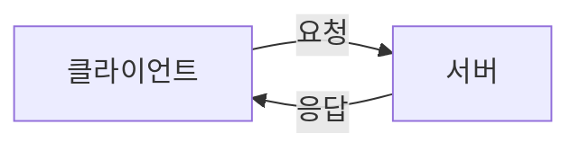

# 🧭 옵시디언 사용법

> 이 저장소를 쓰다가 막힐 때 보는 문서입니다.
> 이 파일 자체도 마크다운이니, 편집 모드(`Ctrl+E`)로 열어보면 문법 예시가 그대로 보입니다.

---

## 1. 기본 개념 3줄

- **보관함(vault)** = 그냥 폴더입니다. 여기서는 `Desktop\TIL` 폴더가 보관함입니다.
- 옵시디언은 그 폴더 안의 `.md` 파일을 **직접 열어서 편집**합니다. 별도 저장 공간이 없습니다.
- 그 폴더가 곧 GitHub 저장소라서, 쓰면 그대로 올라갑니다.

---

## 2. 매일 쓰는 흐름

1. 옵시디언 켜기 → 자동으로 GitHub 최신 내용을 받아옴
2. `Ctrl + N` → 새 노트 (자동으로 `TIL/` 폴더에 생김)
3. 파일명을 `2026-08-01_주제.md` 형식으로 변경
4. 템플릿 삽입 (아래 4번 항목 참고)
5. 수업 들으며 Gemini와 대화 → 한 시간마다 정리본 붙여넣기
6. 수업 끝나고 **주제별 재정리 요청** (아래 6번 항목)
7. 편집 멈추고 5분 뒤 자동 커밋 · 바로 끌 땐 `Ctrl + Shift + Q`

---

## 3. 자주 쓰는 단축키

| 키 | 기능 |
|---|---|
| `Ctrl + N` | 새 노트 |
| `Ctrl + O` | 파일 이름으로 빠르게 찾아 열기 |
| `Ctrl + Shift + F` | **보관함 전체 검색** (시험공부할 때 이걸 제일 많이 씁니다) |
| `Ctrl + F` | 지금 문서 안에서 찾기 |
| `Ctrl + E` | 편집 모드 ↔ 읽기 모드 전환 |
| `Ctrl + P` | 명령 팔레트 (모든 기능을 이름으로 실행) |
| `Ctrl + V` | 캡처한 이미지 붙여넣기 → `attachments/` 에 자동 저장 |
| `Ctrl + Shift + Q` | 커밋 + 푸시 + 종료 |

> 뭔가 하고 싶은데 방법을 모르겠으면 일단 `Ctrl + P` 를 누르고 한국어로 검색해보세요.
> 대부분의 기능이 거기 있습니다.

### 개요(Outline) 패널 켜기

`Ctrl + P` → `개요` 검색 → 실행하면 오른쪽에 **제목 목록**이 뜹니다.
3만 자짜리 문서도 여기서 클릭 한 번으로 원하는 주제로 점프할 수 있습니다.

---

## 4. 템플릿 쓰기

`_templates/TIL.md` 에 템플릿이 들어 있습니다.

**최초 1회 설정**
1. `설정 ⚙️` → `코어 플러그인` → **`템플릿`** 켜기
2. `설정 ⚙️` → `템플릿` → `템플릿 폴더 위치`에 `_templates` 입력
3. `설정 ⚙️` → `단축키` → `템플릿: 템플릿 삽입` 검색 → `Alt + T` 등으로 등록

**사용법**: 새 노트에서 `Alt + T` → `TIL` 선택

---

## 5. 마크다운 문법 (GitHub에서도 잘 보이는 것들)

````text
## 제목 2단계        ← 문서 안 주제는 ## 부터 시작
### 제목 3단계

**굵게**   *기울임*   `인라인 코드`

- 목록
  - 들여쓴 목록
1. 번호 목록

- [ ] 할 일
- [x] 끝낸 일

> 인용문

| 항목 | 설명 |
|---|---|
| 표 | 이렇게 씁니다 |

[링크 텍스트](https://example.com)

```python
print("코드 블록: 언어 이름을 적으면 색이 입혀집니다")
```

---  ← 구분선
````

### 접어두기 (긴 내용 숨기기)

````text
<details>
<summary>클릭하면 펼쳐집니다</summary>

여기에 긴 내용

</details>
````

### 다이어그램 (mermaid)

옵시디언과 GitHub **둘 다** 그림으로 그려줍니다.

````text

````

---

## 6. Gemini에게 정리 요청하는 프롬프트

### ① 수업 중 (한 시간마다)

```text
지금까지 대화한 내용을 마크다운으로 정리해줘.

- 맨 위에 이번 내용의 주제를 ## 제목으로 (# 은 쓰지 마)
- 그 아래 소제목은 ### 로
- 출석 공지나 잡담 같은 행정 내용은 빼고 학습 내용만
- 마지막에 "### 확인 질문" 으로 내가 이해했는지 점검할 질문 3개.
  답은 쓰지 말고 질문만 적어줘.
```

> **확인 질문에 직접 답을 달아보세요.** 2분이면 됩니다.
> 이 문서에서 유일하게 *내 말*로 된 부분이 되고, 시험 때 제일 잘 기억납니다.

### ② 수업 끝나고 (하루 1회)

```text
오늘 나눈 대화 전체를 주제별로 다시 묶어서 정리해줘.

- 시간 순서 말고 주제 순서로. 같은 주제가 여러 번 나왔으면 하나로 합쳐줘
- 맨 위에 YAML frontmatter 로 tags 3~5개 (영어 소문자, 하이픈)
- 주제 제목은 ## 로 시작
- 행정 내용은 제외
```

수업 중에는 강사님이 언제 주제를 끝낼지 알 수 없어 정리가 조각납니다.
이 요청 하나로 흩어진 조각이 주제별로 합쳐집니다.

---

## 7. 나중에 다시 찾기 (시험공부용)

### 전체 검색 — `Ctrl + Shift + F`

```text
stateless          단어가 들어간 모든 글
tag:#http          http 태그가 붙은 글 전부
path:TIL 쿠키      TIL 폴더 안에서 "쿠키" 검색
```

### 태그

글 맨 위 frontmatter에 이렇게 적습니다. (Gemini가 붙여줍니다)

```yaml
---
tags: [http, network, api]
---
```

읽기 모드에서 태그를 **클릭**하면 같은 태그가 붙은 글이 전부 모입니다.

### 글끼리 연결

`[[` 를 입력하면 파일 목록이 뜹니다. 고르면 링크가 만들어집니다.
연결해두면 나중에 그 글을 열었을 때 *어떤 글이 나를 참조하는지* 아래에 표시됩니다.

---

## 8. 문제가 생겼을 때

### GitHub에 안 올라간 것 같을 때

1. 우측 하단 **상태바** 확인 → 숫자가 있으면 아직 커밋 안 된 것
2. `Ctrl + P` → `Commit-and-sync` 실행
3. 그래도 안 되면 `Ctrl + P` → `Open source control view` 에서 오류 메시지 확인

### 사진이 GitHub에서 안 보일 때

편집 모드로 열어서 이미지 문법을 확인하세요.

```text
✅       ← 이건 GitHub에서 보임
❌ ![[파일명.png]]                     ← 이건 옵시디언에서만 보임
```

`❌` 형태라면 `설정 ⚙️` → `파일과 링크` → **`위키링크 사용`을 끄세요.**

### 커밋이 충돌났다고 나올 때

GitHub 웹에서 직접 파일을 고쳤을 때 생깁니다.
`Ctrl + P` → `Pull` 을 먼저 실행한 뒤 다시 커밋하세요.

---

## 9. 이것만은 지키기

- **이미지는 반드시 붙여넣기(`Ctrl+V`)로** — 파일 탐색기에서 끌어다 넣으면 경로가 꼬일 수 있습니다.
- **파일명은 `YYYY-MM-DD_주제`** — 날짜순 정렬이 깨집니다.
- **문서 안 제목은 `##` 부터** — `#` 은 문서 맨 위 제목 하나만.
- **`.obsidian` 폴더는 건드리지 않기** — 설정이 들어 있고, GitHub에는 안 올라갑니다.
